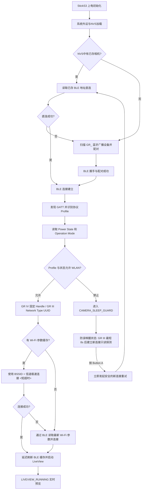

<p align="center">
  <a href="./README.md">
    
  </a>
  <a href="./README_EN.md">
    
  </a>
</p>

<p align="center">
  
</p>

<h1 align="center">RICOH GR Live View Shooting</h1>

<p align="center">
  运行在 M5Stack StickS3 上的理光 (RICOH) GR 远程实时取景器与 BLE 遥控快门固件。
</p>

<p align="center">
  固件以 <strong>BLE 作为相机发现、配对、唤醒和控制入口</strong>，动态获取 Wi-Fi 参数，通过 HTTP API 在 StickS3 上极速流畅渲染 MJPEG 实时取景画面并支持遥控快门。
</p>

> [!NOTE]
> 正在寻找硬件通信协议和状态机细节？请阅读 [docs/project_overview.md](file:///C:/Users/Administrator/Documents/RICOH%20Viewfinder/docs/project_overview.md) 了解整体架构，以及 [docs/ricoh_ble_protocol.md](file:///C:/Users/Administrator/Documents/RICOH%20Viewfinder/docs/ricoh_ble_protocol.md) 了解 BLE 协议详情。

> [!NOTE]
> **关于开发背景**：本项目作者本身不具备嵌入式开发能力，本仓库的全部固件代码、架构设计及相关文档均由 AI 助手 (Codex) 协作编写与整理。若您在代码设计、逻辑实现或稳定性上发现任何问题，敬请见谅。非常欢迎您提交 [Issues](https://github.com/sky18Dragon/RicohViewfinder/issues) 共同讨论或发起 Pull Request 予以完善！

---

## 核心交付内容 (What Ships)

* **高帧率 LiveView 渲染**：基于 ESP32-S3 硬件加速解码的 MJPEG 流处理器，直接输出到 LovyanGFX / M5Canvas，提供流畅的预览体验。
* **分层解耦架构**：重构了传统单文件嵌入式结构，引入了 Supervisor-Controller-Service 设计模式，大大提升了连接稳健度与可维护性。
* **智能休眠防误唤醒**：读取相机 `Power State` 和 `Operation Mode` 以确认真实运行状态，防止意外唤醒关机状态下的相机。
* **运行时协议 Profile**：安全连接后根据 GATT 证据识别 GR III Family 或 GR IV Family；GR III 使用 UUID，GR IV 保留已验证的固定 Handle 路径，未知协议拒绝有副作用的写入。
* **WLAN 动态参数缓存**：首次连接后，将相机的 Wi-Fi SSID、BSSID、信道及加密参数持久化写入 NVS，在下次启动时最快以 `<0.5s` 的极速完成直连。
* **物理按键 AF 遥控快门**：支持理光官方 BLE Shooting Service 协议，通过 Button A 进行高精度自动对焦与瞬间抓拍。
* **一键重置蓝牙配对**：支持长按 Button B 一键清除旧的蓝牙配对及绑定数据，方便快速切换并配对新相机。
* **完整 Native 测试套件**：无需依赖 StickS3 硬件，即可在 Host 端运行核心数据解析和状态转换的本地测试。

---

## 快速开始 (Quick Start)

### 1. 编译并烧录 StickS3 固件
将 M5Stack StickS3 通过 USB 连接至电脑，确保已安装 PlatformIO 环境，运行以下命令编译并烧录固件：
```bash
# 自动编译并烧录固件
platformio run --target upload

# 如有需要，可指定特定的串口（例如 COM6）
platformio run --target upload --upload-port COM6
```

### 2. 首次扫描与安全配对
1. 打开理光 GR 相机，并在菜单设置中启用 **蓝牙连接 (Bluetooth)**。
2. 将 StickS3 上电，屏幕将显示扫描状态。它会自动搜寻以 `GR_` 开头的理光相机 BLE 广播。
3. 发现设备后，StickS3 将与其发起安全绑定配对（Bonding），并将配对标识与相机物理地址存入 NVS。
4. GR III Family 首次配对时，相机会显示六位随机码。StickS3 出现 `PAIRING PASSKEY` 后，短按 Button A 让当前位 `0..9` 循环，长按约 600 ms 确认该位；六位确认后自动提交。此过程不需要电脑，串口输入仅作为调试后备。

### 3. Wi-Fi 连接与 LiveView 启动
1. 蓝牙建立配对后，StickS3 自动发送 Wi-Fi 开启指令，并通过 BLE 实时读取相机动态生成的 Wi-Fi 密码、信道等信息。
2. 随后 StickS3 自动加入相机的 Wi-Fi AP 局域网。
3. 连接成功后，固件从 `/v1/liveview` 拉取 MJPEG 预览流，并在屏幕上流畅渲染取景画面。

---

## 控制操作指南 (Controls)

您可以通过 StickS3 的按键（Button A、Button B、电源键）来控制固件的行为：

| 实体按键 | 状态场景 | 触发行为描述 |
| :--- | :--- | :--- |
| **Button A** | 实时预览中 (`LIVEVIEW_RUNNING`) | 触发 BLE 自动对焦 (AF) 并进行抓拍 (写入 `ShootingFlavor=IMMEDIATE`) |
| **Button A** | GR III 六位码输入 | 短按当前位加一；长按约 600 ms 确认并进入下一位；输入期间不会触发快门或唤醒 |
| **Button A** | 防误唤醒休眠状态 (`CAMERA_SLEEP_GUARD`) | 手动清除 Guard 冷却，强行重建 BLE 连接栈并唤醒/重连相机 |
| **Button B** | 任意状态下 (长按 3 秒) | 触发蓝牙配对重置：清除本地蓝牙配对信息与绑定关系，断开当前 Wi-Fi/BLE 连接，并重新进入 BLE 扫描配对模式 |
| **电源键 (BtnPWR)** | 任意状态下 (双击) | StickS3 关机/开机 |


---

## 核心架构与流转逻辑 (Core Architecture & Flow)

### 1. 软件架构设计
本项目经过重构，实现了清晰的分层和异步事件通知机制：
* **[SystemSupervisor](file:///C:/Users/Administrator/Documents/RICOH%20Viewfinder/src/supervisor/SystemSupervisor.h)**：健康监视器，运行独立的健康轮询任务，负责检测 Wi-Fi/LiveView 连接是否卡死或掉线，并向控制器发送恢复指令。
* **[AppController](file:///C:/Users/Administrator/Documents/RICOH%20Viewfinder/src/app/AppController.h)**：核心业务状态机，统一控制连接生命周期、保护态流转、手动唤醒和全局事件分发。
* **[BleCameraService](src/services/BleCameraService.h)**：BLE 协议驱动层，处理扫描、安全配对绑定、电量状态/操作模式读取及快门触发，对上层隐藏代际 Handle/UUID 差异。
* **[CameraProtocolProfile](src/camera_protocol_profile.h)**：描述 GR II/III/IV 代际能力、WLAN 动作和凭据来源；未知 Profile 默认禁止 WLAN/Power/快门写入。
* **[WifiPreviewService](file:///C:/Users/Administrator/Documents/RICOH%20Viewfinder/src/services/WifiPreviewService.h)**：Wi-Fi 取景服务层，管理 Wi-Fi 状态切换与 HTTP MJPEG 预览数据流的读取。

### 2. 状态机流转流程
以下是系统的核心连接流转图，展示了从上电到 LiveView 运行的整个生命周期：



### 3. 相机关机与休眠保护 (Standby Guard)
理光相机在被动关机（如超时关机或插拔电池）时，或者在 StickS3 上电发现相机处于 `BLE_STARTUP` 待机广播状态时，为了不打扰用户的正常拍摄：
1. 系统会立即主动切断 Wi-Fi 连接和 BLE 物理层，避免占用通道。
2. 自动状态机流转到 `CAMERA_SLEEP_GUARD`。GR III Family 会断开旧连接，并以不短于 **8 秒**的 Profile 间隔建立新连接，仅做服务发现、Power/Operation Mode 读取；探测连接绝不写 WLAN、Power 或快门。
3. 用户可按 Button A 立即发起一次新连接重试，但仍必须重新读到 `CAPTURE` 且 BLE 已认证后，才允许 GR III 写入 WLAN。

---

## 关键配置参数 (Configuration)

您可以通过修改 [src/config.h](file:///C:/Users/Administrator/Documents/RICOH%20Viewfinder/src/config.h) 或 `platformio.ini` 来调整固件表现：

| 参数名称 | 默认值 | 作用与说明 |
| :--- | :---: | :--- |
| `BLE_SCAN_SECONDS` | `2` | 单轮蓝牙扫描寻找相机的时间 (秒) |
| `BLE_FAST_CONNECT_TIMEOUT_MS` | `3000` | 使用已保存的相机地址直连时的超时 (毫秒) |
| `BLE_CONNECT_TIMEOUT_MS` | `8000` | 扫描到设备后建立 BLE 连接的超时 (毫秒) |
| `BLE_CONNECT_ATTEMPTS` | `12` | 存在已配对身份时的最大直连尝试轮数 |
| `RICOH_BLE_BONDED_SECURITY_WAIT_MS` | `1500` | 已绑定设备建立连接后，等待安全加密完成的等待延时 |
| `RICOH_BLE_SECURITY_WAIT_MS` | `7000` | 首次配对时，等待安全加密完成的最大超时 |
| `RICOH_BLE_PASSKEY_ENTRY_WAIT_MS` | `45000` | GR III 六位 Passkey 的设备端输入窗口 |
| `RICOH_BLE_GATT_DIAGNOSTICS` | `0` | 编译期 GATT 表诊断开关；默认关闭且不读取/输出特征值 |
| `RICOH_BLE_POWER_NOTIFY_SETTLE_MS` | `30` | 开启 Power Notify 后的短暂等待窗口，用于在 Wi-Fi ON 前捕获立即到来的关机通知 |
| `WIFI_CACHED_CONNECT_GRACE_MS` | `700` | 发出 Wi-Fi 开启请求后，进行缓存快速连接前的过渡等待 |
| `WIFI_CACHED_CONNECT_TIMEOUT_MS` | `1200` | 缓存 Wi-Fi 参数连接时的超短超时时间 (用于极速直连) |
| `WIFI_CONNECT_TIMEOUT_MS` | `15000` | Wi-Fi 连接建立的全局超时时间上限 |
| `CAMERA_POWER_OFF_COOLDOWN_MS` | `15000` | 进入相机关机保护后的安全冷却期时间 |

---

## 相机兼容性状态 (Camera Compatibility)

> [!NOTE]
> **RICOH GR IV** 与 **RICOH GR IV HDF** 的状态来自原项目实机记录；**RICOH GR IIIx** 已在本分支固件上完成实机验证。**RICOH GR III** 与 HDF 版本仍需独立实机记录，编译通过不等于跨机型验证。

| 相机系列 | 兼容状态 | 兼容性说明 |
| :--- | :---: | :--- |
| **RICOH GR IV HDF** | **已实机验证** | 原项目已验证 BLE 配对/重连、WLAN、LiveView、快门与关机保护；本次安全参数变化仍需按回归矩阵复测。 |
| **RICOH GR IV** | **已实机验证** | 原项目已完成 BLE、WLAN、LiveView 和 BLE AF 快门实机验证；本次改动保留固定 Handle Profile。 |
| **RICOH GR III** | **实现完成，等待实机验证** | 已实现设备端 Passkey、UUID WLAN/凭据、电源与 Capture 门控；仍需 GR III 机身独立实测记录。 |
| **RICOH GR IIIx** | **已实机验证** | 本分支固件已在 GR IIIx 相机上完成实机验证；详细矩阵与去密日志待补充到 `docs/gr3_family_test_record.md`。 |
| **RICOH GR III HDF / GR IIIx HDF** | **实验性支持** | 暂无独立实机证据，不假定 HDF 版本 GATT 完全相同。 |
| **RICOH GR II** | **暂不支持** | 只预留 `Gr2Family`、ManualOnly/ManualConfiguration 能力模型，不含任何虚构 UUID、Handle 或通信实现。 |

---

## 项目源码结构 (Project Structure)

* [platformio.ini](file:///C:/Users/Administrator/Documents/RICOH%20Viewfinder/platformio.ini) — PlatformIO 环境配置文件与依赖项管理
* [src/main.cpp](file:///C:/Users/Administrator/Documents/RICOH%20Viewfinder/src/main.cpp) — 硬件层及主循环初始化入口
* [src/app/](file:///C:/Users/Administrator/Documents/RICOH%20Viewfinder/src/app/) — 状态机管理
  * [AppController.cpp](file:///C:/Users/Administrator/Documents/RICOH%20Viewfinder/src/app/AppController.cpp) / [AppController.h](file:///C:/Users/Administrator/Documents/RICOH%20Viewfinder/src/app/AppController.h) — 状态调度中控
  * [AppState.h](file:///C:/Users/Administrator/Documents/RICOH%20Viewfinder/src/app/AppState.h) — 核心流转状态定义
  * [AppFlowActions.h](file:///C:/Users/Administrator/Documents/RICOH%20Viewfinder/src/app/AppFlowActions.h) — 状态转换转换动作映射
* [src/supervisor/](file:///C:/Users/Administrator/Documents/RICOH%20Viewfinder/src/supervisor/) — 运行健康监护
  * [SystemSupervisor.cpp](file:///C:/Users/Administrator/Documents/RICOH%20Viewfinder/src/supervisor/SystemSupervisor.cpp) / [SystemSupervisor.h](file:///C:/Users/Administrator/Documents/RICOH%20Viewfinder/src/supervisor/SystemSupervisor.h) — 监测任务运行状态并执行故障恢复
* [src/services/](file:///C:/Users/Administrator/Documents/RICOH%20Viewfinder/src/services/) — 协议层与流传输层服务
  * [BleCameraService.cpp](file:///C:/Users/Administrator/Documents/RICOH%20Viewfinder/src/services/BleCameraService.cpp) / [BleCameraService.h](file:///C:/Users/Administrator/Documents/RICOH%20Viewfinder/src/services/BleCameraService.h) — NimBLE 蓝牙连接驱动与协议点读写
  * [WifiPreviewService.cpp](file:///C:/Users/Administrator/Documents/RICOH%20Viewfinder/src/services/WifiPreviewService.cpp) / [WifiPreviewService.h](file:///C:/Users/Administrator/Documents/RICOH%20Viewfinder/src/services/WifiPreviewService.h) — ESP32 STA 连接及 HTTP LiveView 接收驱动
  * [PreviewFrameBuffer.cpp](file:///C:/Users/Administrator/Documents/RICOH%20Viewfinder/src/services/PreviewFrameBuffer.cpp) / [PreviewFrameBuffer.h](file:///C:/Users/Administrator/Documents/RICOH%20Viewfinder/src/services/PreviewFrameBuffer.h) — 预览帧内存缓冲区管理，防止碎片化并优化渲染延迟
* [src/camera_profile_store.cpp](file:///C:/Users/Administrator/Documents/RICOH%20Viewfinder/src/camera_profile_store.cpp) — ESP32 NVS 相机配对及 AP 连接缓存序列化
* [src/jpeg_decoder.cpp](file:///C:/Users/Administrator/Documents/RICOH%20Viewfinder/src/jpeg_decoder.cpp) / [mjpeg_stream.cpp](file:///C:/Users/Administrator/Documents/RICOH%20Viewfinder/src/mjpeg_stream.cpp) — 高帧率 JPEG 硬件加速解码与字节边界切割
* [test/test_native/](file:///C:/Users/Administrator/Documents/RICOH%20Viewfinder/test/test_native/) — 运行在本地主机的架构与关键解析逻辑单元测试

---

## 配件与致谢 (Accessories & Acknowledgements)

* 刚合并的 PR 新增了可用于将 StickS3 安装到相机热靴的 3D 打印安装件。
* 特别感谢 [wjhrdy](https://github.com/wjhrdy) 对 [**GR IV monochrome**](https://github.com/sky18Dragon/RICOH-GR-Live-View-Shooting/issues/2) 的实机验证，以及热靴打印件的提供。
* 特别感谢 Reddit 用户 **JoeBlack-94** 对当前固件进行实机测试并确认其可正常工作，为项目兼容性验证作出了重要贡献。

---

## 故障排查与典型日志 (Troubleshooting)

### 1. 正常开机直连并启动 LiveView（GR IV 结构示例）
```text
BLE: connected secure connect_ms=2800
BLE profile detected=GR4_FAMILY source=gr4_read_probe
Flow: BLE_SCAN -> BLE_READY (BLE connected)
BLE: power profile=GR4_FAMILY value=0x01
BLE: operation mode read value=0x00 state=CAPTURE
BLE: power notify enabled cccd=0x00EC
BLE WLAN activation method=FIXED_HANDLE result=OK
BLE WiFi params profile=GR4_FAMILY ssid_present=1 passphrase_present=1 bssid_present=1 channel=1
WiFi cache: waiting 700ms for camera AP before cached connect
WiFi cache: trying cached params ssid='GR_H264456' bssid='F2:3E:05:26:45:56' channel=1 short_timeout=1200ms
WiFi: connect completed in 450ms channel=1 status=CONNECTED
Flow: WIFI_CONNECTING -> LIVEVIEW_RUNNING (LiveView opened)
LiveView: connected
```

### 2. 相机处于待机状态 (防止意外唤醒)
```text
BLE: power profile=GR3_FAMILY value=0x01
BLE: operation mode read value=0x02 state=BLE_STARTUP
WiFi blocked: camera operation mode=BLE_STARTUP while power=ON source=WiFi open
BLE guard: next power probe in 8000ms (BLE operation mode standby)
BLE guard: remote disconnect reason=533; waiting for camera power on, auto scan continues
```
*(固件断开旧连接，下一次只读探测不会写 WLAN；用户也可按 Button A 请求即时安全重试。)*

### 3. 故障恢复：LiveView 无效帧卡死 (SystemSupervisor 自动介入)
```text
SystemSupervisor: checking preview health...
SystemSupervisor: liveview last frame time 5200 ms ago, threshold is 5000 ms
SystemSupervisor: liveview stall detected! Requesting system recovery.
Flow: LIVEVIEW_RUNNING -> BLE_READY (Resetting connections)
...
```

---

## 开源许可证 (License)

本项目采用 [GNU General Public License v3.0 (GPL-3.0)](file:///C:/Users/Administrator/Documents/RICOH%20Viewfinder/LICENSE) 开源许可证。您可以自由修改、使用和二次发布本固件，但必须根据 GPL-3.0 要求对衍生工程开源。
