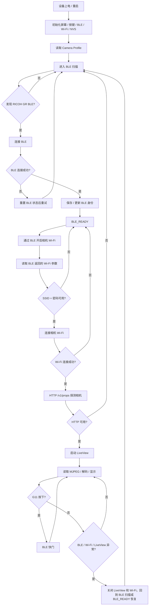

# RICOH GR StickS3 Remote Viewfinder

这是运行在 **M5Stack StickS3** 上的 RICOH GR 远程取景固件。当前版本以 **BLE 作为相机在线状态的唯一入口**：固件先通过 BLE 找到并连接相机，再通过 BLE 请求相机临时开启 Wi-Fi，最后仅把 Wi-Fi 作为 LiveView 高速数据通道使用。

## 当前能力

- BLE 扫描、配对、重连 RICOH GR 相机。
- 通过已验证的 BLE ATT 句柄开启相机 Wi-Fi。
- 从相机 BLE WLAN 参数区读取 Wi-Fi 连接参数。
- 使用相机返回的 SSID / passphrase / BSSID 连接 Wi-Fi。
- 通过 HTTP `/v1/props` 探测相机状态。
- 打开 `/v1/liveview`，读取 MJPEG，解码 JPEG 并显示在 StickS3 屏幕上。
- G11 外接按键按下即触发 BLE 快门。
- Button B 暂停 / 恢复 LiveView。
- 相机关机、BLE 断开、Wi-Fi 断开、LiveView 卡住时自动回到 BLE 扫描恢复流程。

## 硬件

- M5Stack StickS3
- RICOH GR III / GR IIIx / GR IV 或兼容 RICOH GR 机型
- 可选：外接瞬时按键，接在 **GPIO11 (G11)** 与 **GND** 之间

G11 使用 `INPUT_PULLUP`，低电平按下。固件使用 GPIO 中断锁存按下沿，避免 LiveView 解码期间漏按。

## PlatformIO 配置

目标配置位于 `platformio.ini`：

```ini
[env:m5stack-sticks3]
platform = espressif32@6.12.0
board = esp32-s3-devkitc-1
framework = arduino
```

重要说明：

- `platformio.ini` 中不再配置相机 Wi-Fi SSID 或密码。
- 串口波特率：`115200`
- USB CDC 开机启用。
- Core debug level 已收敛为错误级别，避免正式固件输出大量底层日志。

## 构建与烧录

```bash
platformio run
platformio run -t upload
platformio device monitor
```

> 本仓库只负责生成固件；实际烧录和串口监听建议按设备连接情况手动执行。

## 正式工作流程



## Wi-Fi 参数来源

相机 Wi-Fi 不是固件的启动入口。固件会在 BLE 连接成功后写入 Wi-Fi ON 句柄：

- Wi-Fi ON handle：`0x0135`
- ON value：`0x01`

随后读取相机 WLAN 参数区：

- `0x0138`：SSID 候选
- `0x013A`：passphrase / password 候选
- `0x0140`：BSSID 候选
- `0x013C`：安全类型
- `0x013E`：频段 / 附加元数据

如果相机返回的是明文 SSID 和 passphrase，固件会直接连接。如果 passphrase 是 App 协商密钥加密后的 AES-GCM 密文，当前正式固件会拒绝使用静态密码兜底，并保持在 BLE 恢复流程中，等待后续补齐 ECDH / AES-GCM 解密实现。

## 按键行为

- **G11 外接按键**：按下即触发 BLE 快门序列。
- **Button B**：暂停 / 恢复 LiveView。
- **Button A**：保留，不发送相机控制命令。

BLE 快门使用已验证句柄：

- 快门 handle：`0x0099`
- 序列：`01` → `02` → `00`

## 运行日志

正式固件只保留关键日志，例如：

```text
RICOH GR StickS3 Remote Viewfinder V2
Profile: camera='GR_xxxxxx' ble='xx:xx:xx:xx:xx:xx' ip='192.168.0.1'
BLE: scanning for GR camera (2s max)
BLE: selected camera name='GR_xxxxxx' addr=xx:xx:xx:xx:xx:xx rssi=-48
BLE: connected
BLE: Wi-Fi open requested
BLE: Wi-Fi parameters received ssid='GR_xxxxxx' bssid='xx:xx:xx:xx:xx:xx'
WiFi: connected ip=192.168.0.4 rssi=-45
HTTP: camera ready model='RICOH GR IV HDF' battery='66%'
LiveView: connected
```

不会再输出：

- 每帧 JPEG 大小和解码耗时
- BLE Wi-Fi 参数原始字节
- 临时 Probe 详情
- 静态 Wi-Fi 密码相关内容

## 故障处理

### BLE 找不到相机

- 确认相机蓝牙开启。
- 如果是首次使用，确认相机处于可配对 / 可连接状态。
- 固件会持续回到 BLE 扫描，不会直接尝试 Wi-Fi。

### BLE 连接成功但 Wi-Fi 不连接

- 确认日志中出现 `BLE: Wi-Fi open requested`。
- 如果没有出现 `BLE: Wi-Fi parameters received ...`，说明固件没有拿到可用 Wi-Fi 参数。
- 如果相机返回加密 passphrase，需要继续实现 ECDH / AES-GCM 解密后才能完全脱离静态密码。

### LiveView 黑屏或卡住

- 确认 HTTP 探测 `/v1/props` 成功。
- 确认相机允许 Remote Capture / LiveView。
- 固件会在 LiveView 超时后关闭当前连接并回到 BLE 锚点恢复。

### G11 不触发

- 确认外接按键接在 GPIO11 与 GND 之间。
- G11 是低电平触发，固件已使用中断捕获按下沿。
- 如果 BLE 已断开，G11 会先触发相机恢复流程，而不会直接拍摄。
