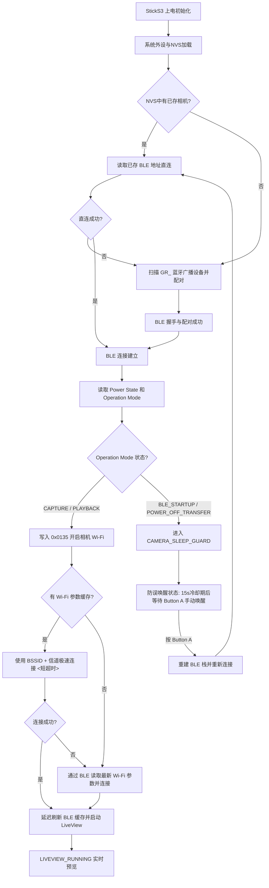

<p align="center">
  <a href="./README.md">
    
  </a>
  <a href="./README_EN.md">
    
  </a>
</p>

<p align="center">
  
</p>

<h1 align="center">RICOH GR Live View Shooting</h1>

<p align="center">
  运行在 M5Stack StickS3 上的理光 (RICOH) GR 远程实时取景器与 BLE 遥控快门固件。
</p>

<p align="center">
  固件以 <strong>BLE 作为相机发现、配对、唤醒和控制入口</strong>，动态获取 Wi-Fi 参数，通过 HTTP API 在 StickS3 上极速流畅渲染 MJPEG 实时取景画面并支持遥控快门。
</p>

> [!NOTE]
> 请阅读 [项目概览](docs/project_overview.md)、[UI Variant 架构](docs/ui_architecture.md)、[Kawaii 主题说明](docs/ui_kawaii_theme.md)、[Wi-Fi / Preview 流程](docs/wifi_preview_flow.md) 和 [BLE 协议说明](docs/ricoh_ble_protocol.md) 了解实现边界。

> [!NOTE]
> **关于开发背景**：本项目作者本身不具备嵌入式开发能力，本仓库的全部固件代码、架构设计及相关文档均由 AI 助手 (Codex) 协作编写与整理。若您在代码设计、逻辑实现或稳定性上发现任何问题，敬请见谅。非常欢迎您提交 [Issues](https://github.com/sky18Dragon/RicohViewfinder/issues) 共同讨论或发起 Pull Request 予以完善！

---

## 核心交付内容 (What Ships)

* **高帧率 LiveView 渲染**：基于 ESP32-S3 硬件加速解码的 MJPEG 流处理器，直接输出到 LovyanGFX / M5Canvas，提供流畅的预览体验。
* **分层架构**：业务采用 Supervisor / Controller / Service 分工；UI 采用 `UiRuntimeSnapshot -> UiPresenter -> UiModel -> UiManager` 数据流。
* **编译期 UI Variant**：提供 Ricoh、Minimal、Debug、Kawaii 和 Rabbit 五套 Renderer；通用元素及主题背景可在编译期裁剪。
* **智能休眠防误唤醒**：读取相机 `Power State` 和 `Operation Mode` 以确认真实运行状态，防止意外唤醒关机状态下的相机。
* **WLAN 动态参数缓存**：首次连接后，将相机的 Wi-Fi SSID、BSSID、信道及加密参数持久化写入 NVS，在下次启动时最快以 `<0.5s` 的极速完成直连。
* **物理按键 AF 遥控快门**：支持理光官方 BLE Shooting Service 协议，通过 Button A 进行高精度自动对焦与瞬间抓拍。
* **一键重置蓝牙配对**：支持长按 Button B 一键清除旧的蓝牙配对及绑定数据，方便快速切换并配对新相机。
* **Native 测试**：无需 StickS3 硬件即可在 Host 端运行基础逻辑、UI Presenter 和 Variant Profile 契约测试。

---

## 快速开始 (Quick Start)

### 1. 编译并烧录 StickS3 固件

确保已安装 PlatformIO。最简编译示例：

```bash
# 默认 Ricoh UI
pio run -e sticks3-ui-ricoh

# Minimal UI
pio run -e sticks3-ui-minimal

# Kawaii UI
pio run -e sticks3-ui-kawaii
pio run -e sticks3-ui-rabbit
```

Debug UI 使用 `pio run -e sticks3-ui-debug`；旧环境名 `m5stack-sticks3` 仍选择 Ricoh UI。Kawaii 的烧录命令为：

```bash
pio run -e sticks3-ui-kawaii --target upload
pio run -e sticks3-ui-rabbit --target upload
```

完整编译矩阵、Native 测试和实机检查见 [测试计划](docs/test_plan.md)。

### Kawaii UI 当前范围

Kawaii 使用 `UI_VARIANT=4`。Rabbit 使用 `UI_VARIANT=5`，把等比例缩放的像素兔子 PNG 放在非 LiveView 页面的右侧安全区，所有文字和状态面板限制在左侧；LiveView 只绘制顶部 HUD 和中间对焦框。两套主题都实现 Boot、Status、LiveView、Settings、Error、Shutdown 六个页面方法；其中 Settings 目前只是静态视觉样稿，`UiPresenter` 和按键流程尚未提供页面导航，页面中的控制项不会修改相机设置。

`UI_FEATURE_MASCOTS` 与 `UI_FEATURE_PATTERN_BACKGROUND` 可分别裁剪角色和图案背景。Kawaii 的 StickS3 屏幕效果、Overlay 可读性、帧率和完整相机链路仍待实机验证，详见 [Kawaii 主题说明](docs/ui_kawaii_theme.md)。

### 2. 首次扫描与安全配对
1. 打开理光 GR 相机，并在菜单设置中启用 **蓝牙连接 (Bluetooth)**。
2. 将 StickS3 上电，屏幕将显示扫描状态。它会自动搜寻以 `GR_` 开头的理光相机 BLE 广播。
3. 发现设备后，StickS3 将与其发起安全绑定配对（Bonding），并将配对标识与相机物理地址存入 NVS。

### 3. Wi-Fi 连接与 LiveView 启动
1. 蓝牙建立配对后，StickS3 自动发送 Wi-Fi 开启指令，并通过 BLE 实时读取相机动态生成的 Wi-Fi 密码、信道等信息。
2. 随后 StickS3 自动加入相机的 Wi-Fi AP 局域网。
3. 连接成功后，固件从 `/v1/liveview` 拉取 MJPEG 预览流，并在屏幕上流畅渲染取景画面。

---

## 控制操作指南 (Controls)

您可以通过 StickS3 的按键（Button A、Button B、电源键）来控制固件的行为：

| 实体按键 | 状态场景 | 触发行为描述 |
| :--- | :--- | :--- |
| **Button A** | 实时预览中 (`LIVEVIEW_RUNNING`) | 触发 BLE 自动对焦 (AF) 并进行抓拍 (写入 `ShootingFlavor=IMMEDIATE`) |
| **Button A** | 防误唤醒休眠状态 (`CAMERA_SLEEP_GUARD`) | 手动清除 Guard 冷却，强行重建 BLE 连接栈并唤醒/重连相机 |
| **Button B** | 任意状态下 (长按 3 秒) | 触发蓝牙配对重置：清除本地蓝牙配对信息与绑定关系，断开当前 Wi-Fi/BLE 连接，并重新进入 BLE 扫描配对模式 |
| **电源键 (BtnPWR)** | 任意状态下 (长按) | 优雅断开 Wi-Fi 局域网与 BLE 连接，关闭 LiveView 取景，StickS3 关机 |


---

## 核心架构与流转逻辑 (Core Architecture & Flow)

### 1. 软件架构设计
本项目经过重构，实现了清晰的分层和异步事件通知机制：

* **[SystemSupervisor](src/supervisor/SystemSupervisor.h)**：健康监视器，检查 Wi-Fi / LiveView 状态并生成恢复事件。
* **[AppController](src/app/AppController.h)**：核心业务状态机，管理连接生命周期、保护态、用户命令和业务事件。
* **[BleCameraService](src/services/BleCameraService.h)**：BLE 扫描、配对、状态读取及快门服务。
* **[WifiPreviewService](src/services/WifiPreviewService.h)**：Wi-Fi 状态与 HTTP MJPEG 数据读取服务。
* **UI 子系统**：`UiRuntimeSnapshot -> UiPresenter -> UiModel -> UiManager<ActiveUiRenderer> -> M5DisplaySurface`；`ActiveUiRenderer` 在编译期选择 Ricoh、Minimal、Debug、Kawaii 或 Rabbit，并统一实现包含 `renderSettings()` 的六方法契约。

UI 分层、`UI_FEATURE_*` 开关和 LiveView Overlay 约束见 [UI Variant 架构](docs/ui_architecture.md)。

### 2. 状态机流转流程
以下是系统的核心连接流转图，展示了从上电到 LiveView 运行的整个生命周期：



### 3. 相机关机与休眠保护 (Standby Guard)
理光相机在被动关机（如超时关机或插拔电池）时，或者在 StickS3 上电发现相机处于 `BLE_STARTUP` 待机广播状态时，为了不打扰用户的正常拍摄：
1. 系统会立即主动切断 Wi-Fi 连接和 BLE 物理层，避免占用通道。
2. 自动状态机流转到 `CAMERA_SLEEP_GUARD`，并开启 **15 秒安全冷却期**。
3. 在冷却期及后续静默状态中，**绝不会自动唤醒相机**，直到用户物理按下 StickS3 的 Button A 触发主动唤醒。

---

## 关键配置参数 (Configuration)

您可以通过修改 [src/config.h](src/config.h) 或 `platformio.ini` 来调整固件表现：

| 参数名称 | 默认值 | 作用与说明 |
| :--- | :---: | :--- |
| `BLE_SCAN_SECONDS` | `2` | 单轮蓝牙扫描寻找相机的时间 (秒) |
| `BLE_FAST_CONNECT_TIMEOUT_MS` | `3000` | 使用已保存的相机地址直连时的超时 (毫秒) |
| `BLE_CONNECT_TIMEOUT_MS` | `8000` | 扫描到设备后建立 BLE 连接的超时 (毫秒) |
| `BLE_CONNECT_ATTEMPTS` | `12` | 存在已配对身份时的最大直连尝试轮数 |
| `RICOH_BLE_BONDED_SECURITY_WAIT_MS` | `1500` | 已绑定设备建立连接后，等待安全加密完成的等待延时 |
| `RICOH_BLE_SECURITY_WAIT_MS` | `7000` | 首次配对时，等待安全加密完成的最大超时 |
| `RICOH_BLE_POWER_NOTIFY_SETTLE_MS` | `30` | 开启 Power Notify 后的短暂等待窗口，用于在 Wi-Fi ON 前捕获立即到来的关机通知 |
| `WIFI_CACHED_CONNECT_GRACE_MS` | `700` | 发出 Wi-Fi 开启请求后，进行缓存快速连接前的过渡等待 |
| `WIFI_CACHED_CONNECT_TIMEOUT_MS` | `1200` | 缓存 Wi-Fi 参数连接时的超短超时时间 (用于极速直连) |
| `WIFI_CONNECT_TIMEOUT_MS` | `15000` | Wi-Fi 连接建立的全局超时时间上限 |
| `CAMERA_POWER_OFF_COOLDOWN_MS` | `15000` | 进入相机关机保护后的安全冷却期时间 |

---

## 相机兼容性状态 (Camera Compatibility)

> [!NOTE]
> 本固件和协议参数已在 **RICOH GR IV** 与 **RICOH GR IV HDF** 上完成实机验证。

| 相机系列 | 兼容状态 | 兼容性说明 |
| :--- | :---: | :--- |
| **RICOH GR IV HDF** | **已验证可用** | 固件核心开发和实机测试靶机，提供最完美的支持。 |
| **RICOH GR IV** | **已验证可用** | 已完成 BLE 配对与重连、Wi-Fi 激活、LiveView 和 BLE AF 快门实机验证。 |
| **RICOH GR III / GR IIIx** | **当前不可用** | BLE 交互时序与相机唤醒逻辑存在代际协议差异，非本固件设计支持目标。 |
| **RICOH GR II** | **当前不可用** | 缺乏低功耗蓝牙 (BLE) 先行广播和按需激活 Wi-Fi AP 的交互链路。 |

---

## 项目源码结构 (Project Structure)

* [platformio.ini](platformio.ini) — 公共配置、五套 UI 环境和旧环境兼容入口
* [src/main.cpp](src/main.cpp) — 对象装配、运行快照、LiveView 帧回调和主循环入口
* [src/app/](src/app/) — `AppController`、业务状态和动作契约
* [src/services/](src/services/) — BLE、相机、Wi-Fi / Preview、快门和帧缓冲服务
* [src/supervisor/](src/supervisor/) — 运行健康监视和恢复事件
* [src/display/](src/display/) — `M5DisplaySurface`、Canvas 生命周期和统一上屏
* [src/ui/model/](src/ui/model/) / [src/ui/presenter/](src/ui/presenter/) — 强类型 UI Model 与映射
* [src/ui/core/](src/ui/core/) — `UiManager`、Feature Flag 和编译期 Renderer 选择
* [src/ui/variants/](src/ui/variants/) — Ricoh、Minimal、Debug、Kawaii、Rabbit Renderer 及各自 Profile
* [src/jpeg_decoder.cpp](src/jpeg_decoder.cpp) / [src/mjpeg_stream.cpp](src/mjpeg_stream.cpp) — JPEG 解码与 MJPEG 帧边界解析
* [test/](test/) — 基础逻辑、Presenter 和 Variant 契约的 Native 测试

---

## 故障排查与典型日志 (Troubleshooting)

### 1. 正常开机直连并启动 LiveView
```text
BLE: connected secure connect_ms=2800
Flow: BLE_SCAN -> BLE_READY (BLE connected)
BLE: power handle=0x00EB read value=0x01
BLE: operation mode read value=0x00 state=CAPTURE
BLE: power notify enabled cccd=0x00EC
BLE: Wi-Fi open requested
BLE: Wi-Fi parameters received ssid='GR_H264456' bssid='F2:3E:05:26:45:56' freq=2412 channel=1
WiFi cache: waiting 700ms for camera AP before cached connect
WiFi cache: trying cached params ssid='GR_H264456' bssid='F2:3E:05:26:45:56' channel=1 short_timeout=1200ms
WiFi: connect completed in 450ms channel=1 status=CONNECTED
Flow: WIFI_CONNECTING -> LIVEVIEW_RUNNING (LiveView opened)
LiveView: connected
```

### 2. 相机处于待机状态 (防止意外唤醒)
```text
BLE: power handle=0x00EB read value=0x01
BLE: operation mode read value=0x02 state=BLE_STARTUP
WiFi blocked: camera operation mode=BLE_STARTUP while power=ON source=WiFi open
Flow: BLE_READY -> CAMERA_SLEEP_GUARD (BLE operation mode standby)
BLE guard: remote disconnect reason=533; auto wake paused for 15s, then manual wake required
```
*(此时固件自动断开并挂起，不唤醒相机，防止电池被不必要地消耗)*

### 3. 故障恢复：LiveView 无效帧卡死 (SystemSupervisor 自动介入)
```text
SystemSupervisor: checking preview health...
SystemSupervisor: liveview last frame time 5200 ms ago, threshold is 5000 ms
SystemSupervisor: liveview stall detected! Requesting system recovery.
Flow: LIVEVIEW_RUNNING -> BLE_READY (Resetting connections)
...
```

---

## 开源许可证 (License)

本项目采用 [GNU General Public License v3.0 (GPL-3.0)](LICENSE) 开源许可证。您可以自由修改、使用和二次发布本固件，但必须根据 GPL-3.0 要求对衍生工程开源。
