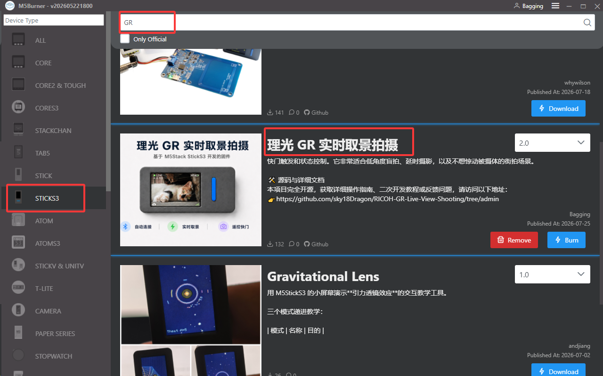
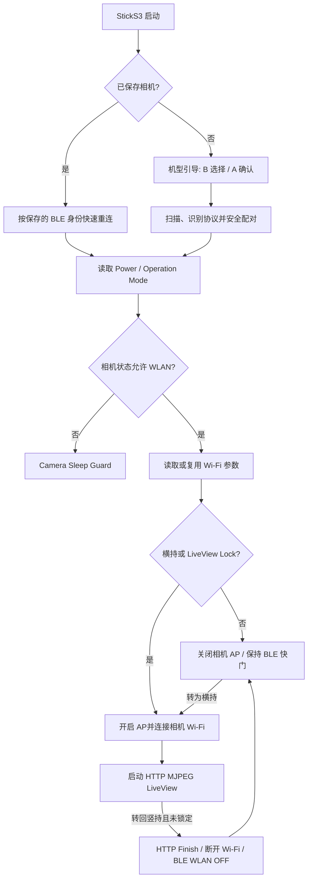

<p align="center">
  <a href="./README.md"></a>
  <a href="./README_EN.md"></a>
</p>

<p align="center">
  
</p>

<h1 align="center">RICOH GR Live View Shooting</h1>

<p align="center">
  运行在 M5Stack StickS3 上的 RICOH GR 蓝牙遥控快门与无线实时取景固件。
</p>

固件使用 BLE 完成机型识别、配对、重连、相机状态读取、WLAN 控制以及对焦拍摄；使用相机 Wi-Fi 和 HTTP MJPEG 提供 LiveView。竖持时作为低功耗蓝牙快门，横持时自动进入实时取景，切回竖持会退出 LiveView 并关闭相机 AP。

> [!IMPORTANT]
> 首次使用必须在 StickS3 配对引导中选择正确的相机代际。GR III、GR IIIx 及其 HDF 版本选择 **GR III**；GR IV 与 GR IV HDF 选择 **GR IV**。

## 支持状态

| 相机 | 当前状态 | 通信方式 |
| :--- | :---: | :--- |
| RICOH GR III | 已实现，仍需完整独立回归 | GR III Family UUID 协议、动态六位 Passkey |
| RICOH GR IIIx | 已实机验证 | 与 GR III 使用同一套配对和通信参数 |
| RICOH GR III HDF / GR IIIx HDF | 实验性支持 | 暂按 GR III Family 处理，缺少独立实机证据 |
| RICOH GR IV | 已实机验证 | GR IV Legacy 固定 Handle 协议 |
| RICOH GR IV HDF | 已实机验证 | 与 GR IV 使用同一代协议 |
| RICOH GR II | 暂不支持 | 仅保留能力模型，没有可用通信实现 |

详细的证据范围和安全约束参见 [项目架构](docs/project_overview.md)、[BLE 协议说明](docs/ricoh_ble_protocol.md) 和 [已知问题](docs/known_issues.md)。

## 主要功能

- 首次配对机型引导，GR III Family 与 GR IV Family 使用完全隔离的安全参数和通信路径。
- 保存相机 BLE 身份、Bond、协议 Profile 和 Wi-Fi 参数，后续优先按地址快速重连。
- Button A 一次按下只触发一次自动对焦并拍摄，GR III 不再需要按第二次。
- 竖持保持 BLE 快门可用并关闭相机 AP；横持重新开启 AP、连接 Wi-Fi 并启动 LiveView。
- GR III 与 GR IV 在 LiveView 期间都保持 BLE，确保对焦快门路径稳定。
- 退出 LiveView 时先尝试 HTTP WLAN Finish，再断开 StickS3 Wi-Fi，最后通过 BLE 关闭相机 AP。
- Button B 单击切换画面镜像、双击锁定 LiveView、长按 3 秒清除配对。
- IMU 姿态滤波、滞回和稳定时间控制，减少横竖屏临界角度抖动。
- 256 KB PSRAM 帧缓冲、8192 字节流缓冲和 ESP32-S3 优化 JPEG 解码。
- Wi-Fi、MJPEG 数据流和有效帧看门狗，LiveView 异常时自动恢复连接。
- 相机待机保护，避免设备持续扫描或写入 WLAN 导致相机被意外唤醒。
- 本机电量/充电状态、相机状态、连接动画、快门反馈和声音提示。

## 硬件与软件

- M5Stack StickS3（ESP32-S3-PICO-1，8 MB Flash，8 MB PSRAM）
- 受支持的 RICOH GR 相机
- USB-C 数据线
- 预编译全量 BIN + M5Burner，或 PlatformIO Core

默认构建环境使用 Arduino、`espressif32@6.12.0`、M5Unified、M5PM1、NimBLE-Arduino 2.5.0、ArduinoJson 7.x 和 Espressif `esp_new_jpeg`。

## 安装固件

### 使用 M5Burner

不需要安装编程环境，也不需要下载源代码。准备一台 StickS3、一根可传输数据的 USB-C 线和 Chrome/Edge 浏览器，然后按下面操作：

1. 打开 M5Stack 官方在线烧录网站：[https://burner.m5stack.com/](https://burner.m5stack.com/)。
2. 在页面顶部搜索框输入 `GR`，点击“搜索”。
3. 找到名称为 **“理光 GR 实时取景拍摄”** 的固件卡片，并确认设备是 **StickS3**、作者是 **TinkerZhang**。
4. 点击固件卡片进入详情页，再点击页面中的“烧录”按钮。
5. 使用 USB-C 数据线连接 StickS3。浏览器询问串口权限时，选择对应的 **USB JTAG/serial debug unit** 或 StickS3 串口并允许连接。
6. 按页面提示开始烧录。烧录期间不要拔线或关闭网页，等待页面提示成功并让 StickS3 自动重启。
7. 首次启动会进入相机机型选择页面：Button B 选择 GR III/GR IV，Button A 确认。



> [!TIP]
> 如果这个固件对你有帮助，欢迎在固件卡片或详情页点击 **爱心点赞**。你的点赞可以帮助作者 **TinkerZhang** 积累 M5Stack 社区积分，也会支持项目继续维护和更新，谢谢！

> [!WARNING]
> 请认准 StickS3 设备和作者 TinkerZhang，不要选择名称相近但目标设备不同的固件。M5Burner 社区中的正式版本已经包含完整烧录镜像，普通用户不需要设置地址或 Flash Mode。开发者手动导入 BIN 时，才需要使用包含 Bootloader、分区表、`boot_app0` 和应用程序的全量镜像，并从 `0x0000` 以 DIO 参数烧录；不要把 `.pio/build/m5stack-sticks3/firmware.bin` 当作全量镜像。

### 从源码编译

```bash
# 编译并烧录 StickS3
pio run -e m5stack-sticks3 -t upload

# 查看串口日志
pio device monitor -b 115200
```

自动识别串口失败时，追加 `--upload-port <串口>`。

## 首次配对

1. 打开相机，在相机菜单中进入蓝牙配对状态。
2. 没有已保存相机时，StickS3 显示机型选择页面。
3. 按 **Button B** 在 `GR III` 和 `GR IV` 之间切换，按 **Button A** 确认。
4. 固件只扫描并接受与所选代际一致的相机；代际识别不匹配时不会执行 WLAN、电源或快门写入。
5. 配对成功后，相机身份、协议 Profile、Bond 和可用 Wi-Fi 参数会保存到 NVS。

配对引导页面会独占 A/B 按键，因此选择机型时不会触发快门、镜像、LiveView Lock 或清除配对。

### GR III / GR IIIx 六位码

GR III Family 使用相机屏幕显示的动态六位 Passkey：

- A 短按：当前数字加一（0–9 循环）。
- B 短按：确认当前数字并移动到下一位。
- A 长按：直接提交当前六位数字。
- B 长按 3 秒：取消本次输入并进入清除配对流程。
- 输入窗口：45 秒。

### GR IV / GR IV HDF

GR IV Family 保留原有 Legacy 安全配置和固定 Passkey `123456`。固件不会把 GR III 的 KeyboardDisplay、安全密钥分发或 UUID WLAN 路径应用到 GR IV。

## 日常操作

| 按键 | 场景 | 行为 |
| :--- | :--- | :--- |
| Button A | 配对引导 | 确认选中的相机代际 |
| Button B | 配对引导 | 在 GR III / GR IV 之间切换 |
| Button A | 相机可拍摄 | 按下时触发一次 AF + 快门；持续按住不会重复发送 |
| Button A | 相机休眠保护 | 请求一次安全的手动重连，不触发拍摄 |
| Button B 单击 | 正常界面 | 切换并保存 LiveView 画面镜像 |
| Button B 双击 | LiveView | 开关 LiveView Lock；锁定后转为竖持仍保持预览 |
| Button B 长按 3 秒 | 已配对状态 | 清除相机 Profile、Wi-Fi 缓存和 BLE Bonds，然后返回配对引导 |
| 电源键长按约 1.2 秒 | 任意状态 | 关闭 StickS3 |

Button A 按住超过 300 ms 会显示对焦动画和声音反馈，但拍摄命令仍只发送一次。

## 横竖屏与相机 AP

### 竖持：蓝牙快门

- 保持 BLE 连接，用于对焦、快门和相机状态处理。
- 已有有效 Wi-Fi 缓存时不会为了重复读取参数而开启 AP。
- 首次配对需要读取参数时会短暂开启 AP，读取完成后立即通过 BLE 关闭。
- 从 LiveView 切回竖持时关闭 HTTP 流、断开 StickS3 Wi-Fi，并对 GR III/GR IV 发送各自的 WLAN OFF 命令。

### 横持：LiveView

- 通过 BLE 重新开启相机 AP。
- 优先使用缓存的 SSID、BSSID 和信道快速连接；失败后回退到最新 BLE 参数。
- 打开 `/v1/liveview` MJPEG 流，并在首帧后延迟读取 `/v1/props`。
- BLE 在 GR III 和 GR IV 上都保持连接，Button A 继续走 BLE AF 快门。

设备姿态需要稳定约 500 ms 才切换；如果 IMU 不可用，固件按横屏预览模式运行。双击 B 开启 LiveView Lock 后，预览不再跟随姿态关闭。

## GR III 与 GR IV 的协议差异

| 项目 | GR III / GR IIIx | GR IV / GR IV HDF |
| :--- | :--- | :--- |
| 配对 | 相机动态六位码，KeyboardDisplay | Legacy 固定 `123456`，DisplayYesNo |
| WLAN 控制 | Service/Characteristic UUID | 已验证的固定 Handle |
| Wi-Fi 参数 | SSID、Passphrase、可选 Channel；连接后回采 BSSID | SSID、Passphrase、Security、Frequency、BSSID |
| 快门准备 | 直接写 Operation Request `{START, AF}` | 先写 Legacy Shooting Flavor，再写 Operation Request |
| LiveView 期间 BLE | 保持 | 保持 |
| 退出 LiveView | HTTP Finish + BLE UUID WLAN OFF | HTTP Finish + BLE Handle WLAN OFF |

GR III 和 GR IIIx 在当前代码中属于同一个 `GR3_FAMILY`，没有拆分配对或通信参数；GATT 特征按 UUID 动态发现，不依赖 GR IIIx 日志中的参考 Handle。

## 运行流程


```mermaid
flowchart TD
    A[StickS3 启动] --> B{已保存相机?}
    B -->|否| C[机型引导: B 选择 / A 确认]
    B -->|是| D[按保存的 BLE 身份快速重连]
    C --> E[扫描、识别协议并安全配对]
    D --> F[读取 Power / Operation Mode]
    E --> F
    F --> G{相机状态允许 WLAN?}
    G -->|否| H[Camera Sleep Guard]
    G -->|是| I[读取或复用 Wi-Fi 参数]
    I --> J{横持或 LiveView Lock?}
    J -->|否| K[关闭相机 AP / 保持 BLE 快门]
    J -->|是| L[开启 AP并连接相机 Wi-Fi]
    L --> M[启动 HTTP MJPEG LiveView]
    M -->|转回竖持且未锁定| N[HTTP Finish / 断开 Wi-Fi / BLE WLAN OFF]
    N --> K
    K -->|转为横持| L
```

## 构建与测试

```bash
# 运行 Host Native 测试
pio test -e native

# 编译 StickS3 发布固件
pio run -e m5stack-sticks3
```

当前提交基线：

- Native：85 / 85 通过。
- StickS3：构建成功。
- RAM：65,468 / 327,680 bytes（20.0%）。
- Flash：1,401,749 / 3,342,336 bytes（41.9%）。

自动化测试覆盖协议识别、安全 Profile、配对恢复、NVS 迁移、姿态切换、按钮隔离、AP 生命周期、BLE 快门、MJPEG 解析、UI 和运行看门狗。自动测试不能替代各相机型号和固件版本的实机回归。

## 常见问题

### 烧录后黑屏

- 确认使用的是从 `0x0000` 烧录的全量合并 BIN。
- 确认 Bootloader Flash Mode 保持为 DIO，没有被合并工具强制改成 QIO。
- 重新清除 Flash 后烧录已验证的发布包。

### 找不到相机或配对失败

- 确认相机已进入蓝牙配对页面，并且配对引导选择了正确代际。
- 如果相机端已经删除 StickS3，设备端也需长按 B 3 秒清除旧 Bond 后重新配对。
- GR III Family 应输入相机当前显示的六位码；不要使用 GR IV 的固定码。

### 横持没有进入 LiveView

- 确认没有处于相机休眠保护或配对引导页面。
- 保持横持至少 500 ms；必要时双击 B 开启 LiveView Lock。
- 使用 115200 波特率日志检查 BLE WLAN ON、Wi-Fi 连接和 `/v1/liveview` 状态。

### 切回竖持后相机 AP 仍存在

正常日志应先出现 HTTP WLAN Finish，随后出现 Wi-Fi 断开和 BLE WLAN deactivation。相机可能需要短暂时间停止广播；如果持续存在，请记录相机型号、固件版本和完整切换日志。

## 项目结构

- [src/main.cpp](src/main.cpp)：硬件初始化、主循环和业务动作适配。
- [src/app/](src/app/)：连接、姿态、AP 和 LiveView 状态机。
- [src/ricoh/](src/ricoh/) 与 [src/ricoh_ble_client.cpp](src/ricoh_ble_client.cpp)：GR III/GR IV 协议路由和 BLE 实现。
- [src/services/](src/services/)：BLE、Wi-Fi、LiveView 和快门服务。
- [src/ui/](src/ui/)：配对引导、按键、姿态、动画、声音和场景协调。
- [src/camera_profile_store.cpp](src/camera_profile_store.cpp)：相机 Profile、显示设置和 Wi-Fi 缓存持久化。
- [src/jpeg_decoder.cpp](src/jpeg_decoder.cpp) 与 [src/mjpeg_stream.cpp](src/mjpeg_stream.cpp)：JPEG 解码和 MJPEG 切帧。
- [test/test_native/](test/test_native/)：Host Native 自动化测试。
- [docs/](docs/)：协议、状态机、硬件验证和测试资料。
- [cad/](cad/)：StickS3 热靴安装配件及可编辑模型。

## 配件与贡献

仓库提供可打印的 StickS3 热靴安装配件，详见 [cad/README.md](cad/README.md)。欢迎通过 [Issues](https://github.com/sky18Dragon/RICOH-GR-Live-View-Shooting/issues) 提交机型、相机固件、StickS3 commit 和已脱敏日志，也欢迎提交 Pull Request。

本项目由作者与 AI 助手 Codex 协作开发。感谢所有参与协议分析、实机验证和结构件设计的贡献者。

## 许可证

本项目采用 [GNU General Public License v3.0](LICENSE)。修改、使用和再发布时，衍生作品必须遵守 GPL-3.0。
