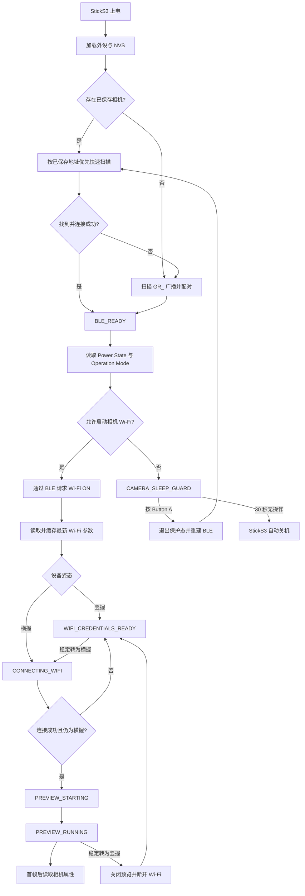

<p align="center">
  <a href="./README.md">
    
  </a>
  <a href="./README_EN.md">
    
  </a>
</p>

<p align="center">
  
</p>

<h1 align="center">RICOH GR Live View Shooting</h1>

<p align="center">
  运行在 M5Stack StickS3 上的理光（RICOH）GR 姿态感知遥控快门与无线实时取景固件。
</p>

<p align="center">
  固件以 <strong>BLE 作为相机发现、配对、唤醒与控制入口</strong>，动态读取并缓存相机 Wi-Fi 参数；竖握时保持低功耗遥控界面，横握时才连接相机 Wi-Fi 并通过 HTTP 渲染 MJPEG LiveView。
</p>

> [!NOTE]
> 通信协议和状态机细节请参阅 [项目架构概览](docs/project_overview.md) 与 [RICOH BLE 协议说明](docs/ricoh_ble_protocol.md)。UI 架构、姿态阈值和实机验证清单见 [UI 与交互设计](docs/ui_interaction_design.md)。

欢迎通过 [Issues](https://github.com/sky18Dragon/RICOH-GR-Live-View-Shooting/issues) 或 Pull Request 反馈问题与改进建议。

---

## 核心能力

- **姿态门控的连接生命周期**：竖握只完成 BLE 连接、相机 Wi-Fi 开启和参数缓存，不建立 Wi-Fi STA 连接；横握先启动 LiveView，首帧显示后再读取相机属性。
- **横竖屏专属界面**：竖握显示 135×240 遥控光圈，横握使用 240×135 预览画布；姿态切换采用低通滤波、滞回、稳定时间和最短保持时间抑制抖动。
- **更快的 LiveView 渲染**：Espressif SIMD JPEG 解码器把 GR III 系列画面直接缩放为 216 x 144 RGB565，再居中显示 216 x 135 区域，不做第二次缩放。
- **分层内存策略**：横屏 Canvas 优先使用内部 RAM，JPEG 输出和 256 KB MJPEG 帧缓冲使用 PSRAM；分配失败时均有安全回退。
- **更快的首次 BLE 配对**：识别到有效 RICOH 广播后提前结束扫描，扫描到连接的等待缩短为 50 ms；若首次 SMP 未启动，会在短探测窗口后快速重试，同时为后续相机确认保留完整时间。
- **真实连接驱动的扫描动画**：扫描与连接期间两个亮绿色圆点循环靠近、分开；只有 BLE 链路真正建立后才合并为一个圆。
- **相机待机保护与自动关机**：相机主动关机、发送关机通知或 BLE 断链后进入 `CAMERA_SLEEP_GUARD`，停止自动扫描和重连；30 秒无操作后 StickS3 自动关机。
- **WLAN 参数缓存**：将 SSID、BSSID、信道、密码和加密信息持久化到 NVS，用于后续横握连接的缓存快速路径；BLE 仍是连接与相机 Wi-Fi 激活的控制锚点。
- **低延迟 BLE AF 快门**：Button A 按下沿立即发送一次 AF+拍摄命令；连接建立时预热 Shooting Service/Characteristic，缓存 GATT 对象并请求低延迟连接参数，后续拍摄复用已准备好的链路。
- **可恢复的运行监控**：周期性检查 Wi-Fi、HTTP 流和有效 JPEG 帧健康度，LiveView 卡死时触发连接恢复。
- **Host Native 测试**：51 项本地测试覆盖姿态门控状态机、CameraSleep、MJPEG 解析、Supervisor、按键输入、图像适配、姿态判断、UI 动画和相机协议识别。

---

## 快速开始

### 1. 使用 M5Burner 直接下载烧录（推荐）

不需要安装开发环境。打开 [M5Burner](https://docs.m5stack.com/en/download)，按以下步骤操作：

1. 在左侧设备列表选择 **STICKS3**。
2. 在顶部搜索框输入 **GR**。
3. 找到 **“理光 GR 实时取景拍摄”**。
4. 选择需要的版本，点击 **Download** 下载固件。
5. 将 StickS3 通过 USB 连接电脑，点击 **Burn** 完成烧录。


> [!TIP]
> 如果已经下载过该固件，项目卡片会直接显示 **Burn**；需要切换版本时，可先在右侧版本下拉框中选择。

### 2. 从源码编译并烧录

将 M5Stack StickS3 通过 USB 连接至电脑，安装 PlatformIO Core 后执行：

```bash
# 编译并烧录默认 StickS3 环境
platformio run -e m5stack-sticks3 --target upload

# 查看 115200 波特率串口日志
pio device monitor -b 115200
```

自动识别串口失败时可追加 `--upload-port <串口>`。

### 3. 首次扫描与安全配对

1. 打开 RICOH GR 相机，并在菜单中启用蓝牙连接。
2. StickS3 上电后自动扫描以 `GR_` 开头的 BLE 广播。
3. 找到有效且可连接的 RICOH 广播后会立即结束本轮扫描并开始安全绑定（Bonding）。
4. GR III 系列相机会显示六位配对码。在 StickS3 上用 Button A 修改当前数字，短按 Button B 确认并移到下一位。GR IV 系列继续使用原有确认流程。
5. 配对成功后，相机身份、BLE 地址与绑定信息会保存到 NVS。

首次安全协商如果没有真正启动，固件会在 3 秒探测窗口后以 150 ms 间隔快速进入第二轮，而不是完整空等；第二轮及后续尝试仍保留 7 秒确认窗口。

### 4. 姿态控制的 Wi-Fi 与 LiveView

1. BLE 建立后，固件读取相机电源与运行模式；允许连接时，通过 BLE 请求开启相机 Wi-Fi 并读取最新参数。
2. **竖握启动**：参数写入缓存后停在 `WIFI_CREDENTIALS_READY`，不加入相机 AP。
3. **横握启动**：读取并缓存参数后继续连接相机 AP，先启动 LiveView，首帧显示后再读取相机属性。
4. **竖握转横握**：从已缓存参数继续后续流程，无需重新扫描 BLE。
5. **横握转竖握**：关闭 LiveView、断开相机 Wi-Fi，回到 `WIFI_CREDENTIALS_READY`；BLE 与参数缓存继续保留。

在 Wi-Fi 连接等待过程中如果设备转回竖握，连接 Guard 会取消本次连接并回到参数就绪状态。IMU 不可用时按横握处理，保留原完整连接流程。

### 5. 验证构建与测试

```bash
# 编译 Host Native 目标
platformio run -e native

# 运行 51 项 Native 测试
platformio test -e native

# 编译 StickS3 固件
platformio run -e m5stack-sticks3
```

当前基线构建占用：RAM 82,892 / 327,680 bytes（25.3%），Flash 1,322,213 / 3,342,336 bytes（39.6%）。

---

## 控制与交互

| 实体按键 | 状态场景 | 行为 |
| :--- | :--- | :--- |
| **Button A** | GR III 配对码输入 | 修改当前高亮数字 |
| **Button B** | GR III 配对码输入，短按 | 确认当前数字并移到下一位 |
| **Button B** | 非配对码输入界面，短按 | 切换 LiveView 镜像显示并保存设置 |
| **Button A** | 相机可拍摄状态 | 按下时立即发送一次 AF+拍摄命令；持续按住只显示光圈收缩、亮绿色和提示音，不会重复发送或连拍 |
| **Button A** | `CAMERA_SLEEP_GUARD` | 退出保护态、重建 BLE 栈并进入扫描场景，不触发拍摄 |
| **Button B** | 任意状态，长按 3 秒 | 显示连续进度；达到阈值后只触发一次 BLE 配对与缓存重置，中途松开则取消 |
| **电源键（BtnPWR）** | 任意状态，长按约 1.2 秒 | 关闭 StickS3 电源 |

交互规则：

- 竖握显示中央遥控光圈；横握显示等比例 LiveView 和微型电量图标。
- 扫描与 BLE 建连阶段始终显示两个亮绿色圆点来回靠近；只有 `bleConnected=true` 后才合并。
- 拍摄时，竖屏显示 300 ms 快门闪烁，横屏显示 100 ms 白色快门边框。
- 姿态每 40 ms 采样，需要稳定 500 ms 才切换，并至少保持 500 ms。
- 活跃背光为 180，休眠背光为 24；变暗动画 900 ms，唤醒提亮 180 ms。
- 遥控动画目标帧率 25 FPS，休眠动画 8 FPS，提示音音量 40。

原始交互原型归档于 [StickS3 Interaction Prototype](docs/ui-reference/StickS3_Interaction_Prototype.html)。

---

## 核心架构与状态机

### 软件分层

- **[AppController](src/app/AppController.h)**：核心业务状态机，统一处理连接生命周期、姿态门控、保护态和恢复事件。
- **[SystemSupervisor](src/supervisor/SystemSupervisor.h)**：由主循环周期调用的健康监视器，检测预览关闭、流停滞和有效帧超时。
- **[BleCameraService](src/services/BleCameraService.h)**：负责 BLE 扫描、绑定、重连、相机状态与 Wi-Fi 参数读取，以及快门控制。
- **[WifiPreviewService](src/services/WifiPreviewService.h)**：负责 Wi-Fi STA、相机属性、MJPEG 流和 LiveView 生命周期。
- **[UiCoordinator](src/ui/UiCoordinator.h)**：将应用状态、姿态和用户输入映射为 UI 场景与命令。
- **[OrientationTracker](src/ui/OrientationTracker.h)**：根据 StickS3 实机坐标轴完成低通、滞回和稳定时间判断。

### 状态机流转


```mermaid
flowchart TD
    A[StickS3 上电] --> B[加载外设与 NVS]
    B --> C{存在已保存相机?}
    C -->|是| D[按已保存地址优先快速扫描]
    C -->|否| E[扫描 GR_ 广播并配对]
    D --> F{找到并连接成功?}
    F -->|否| E
    F -->|是| G[BLE_READY]
    E --> G
    G --> H[读取 Power State 与 Operation Mode]
    H --> I{允许启动相机 Wi-Fi?}
    I -->|否| J[CAMERA_SLEEP_GUARD]
    I -->|是| K[通过 BLE 请求 Wi-Fi ON]
    K --> L[读取并缓存最新 Wi-Fi 参数]
    L --> M{设备姿态}
    M -->|竖握| N[WIFI_CREDENTIALS_READY]
    M -->|横握| O[CONNECTING_WIFI]
    N -->|稳定转为横握| O
    O --> P{连接成功且仍为横握?}
    P -->|否| N
    P -->|是| R[PREVIEW_STARTING]
    R --> S[PREVIEW_RUNNING]
    S --> Q[首帧后读取相机属性]
    S -->|稳定转为竖握| T[关闭预览并断开 Wi-Fi]
    T --> N
    J -->|按 Button A| U[退出保护态并重建 BLE]
    J -->|30 秒无操作| V[StickS3 自动关机]
    U --> D
```

### 相机关机与休眠保护

当相机主动关机、通过 BLE 通知电源为 `0x00`，或已建立链路后发生非零原因断链时，固件清理 Wi-Fi/预览连接并进入 `CAMERA_SLEEP_GUARD`。该场景不会自行扫描、重连或再次开启相机 Wi-Fi；只有 Button A 能退出保护态并回到扫描场景。若 30 秒内没有操作，StickS3 自动关机。重复的 Guard 阻止日志每次进入保护态只打印一次，避免刷屏。

---

## 关键配置

连接与保护参数位于 [src/config.h](src/config.h)，UI 和姿态参数位于 [src/ui/UiTheme.h](src/ui/UiTheme.h)：

| 参数 | 默认值 | 说明 |
| :--- | :---: | :--- |
| `BLE_SCAN_SECONDS` | `2` | 单轮 BLE 扫描时长（秒） |
| `BLE_CONNECT_TIMEOUT_MS` | `8000` | 扫描后 BLE 建连超时 |
| `BLE_SCAN_TO_CONNECT_DELAY_MS` | `50` | 扫描完成到开始连接的稳定等待 |
| `RICOH_BLE_FIRST_PAIRING_PROBE_MS` | `3000` | 首轮未启动 SMP 时的快速探测窗口 |
| `BLE_FIRST_PAIRING_RETRY_DELAY_MS` | `150` | 首次配对探测失败后的快速重试间隔 |
| `WIFI_CACHED_CONNECT_GRACE_MS` | `700` | 请求 Wi-Fi ON 后的缓存连接等待时间 |
| `WIFI_CACHED_CONNECT_TIMEOUT_MS` | `1200` | 使用缓存 BSSID 与信道的快速连接超时 |
| `WIFI_CONNECT_TIMEOUT_MS` | `15000` | Wi-Fi STA 总连接超时 |
| `LIVEVIEW_STALL_TIMEOUT_MS` | `5000` | 有效预览帧停滞阈值 |
| `CAMERA_SLEEP_AUTO_POWER_OFF_MS` | `30000` | CameraSleep 无操作自动关机时间 |
| `POWER_BUTTON_HOLD_MS` | `1200` | 电源键关机长按阈值 |
| `KEY2_PAIRING_RESET_HOLD_MS` | `3000` | Button B 配对重置长按阈值 |
| `kOrientationSampleMs` | `40` | IMU 姿态采样周期 |
| `kOrientationStableMs` | `500` | 姿态候选稳定时间 |
| `kOrientationMinHoldMs` | `500` | 姿态切换后的最短保持时间 |
| `kOrientationHysteresisG` | `0.18f` | 横竖屏切换滞回 |
| `kOrientationMinAxisG` | `0.35f` | 有效主轴最小重力分量 |

StickS3 实机轴映射为：`abs(X)` 主导时判定竖握，`abs(Y)` 主导时判定横握。

---

## 相机兼容性

> [!NOTE]
> 当前固件已在 **RICOH GR IV**、**RICOH GR IV HDF** 和 **RICOH GR III HDF** 上完成实机验证。其他 GR III 系列机型仍需单独回归测试。

| 相机系列 | 状态 | 说明 |
| :--- | :---: | :--- |
| **RICOH GR IV HDF** | **已验证** | 核心开发与实机测试目标，支持 BLE 快门和 LiveView |
| **RICOH GR IV** | **已验证** | 已验证 BLE 配对/重连、Wi-Fi 激活、LiveView 和 BLE AF 快门 |
| **RICOH GR III HDF** | **已验证** | 2026-08-01 实机验证首次配对、认证绑定、Wi-Fi 激活、`/v1/props` 和 LiveView |
| **RICOH GR III / GR IIIx** | **实验性支持** | 与已验证的 GR III HDF 共用 UUID 协议路径，但仍需在本分支上完成独立实机回归 |
| **RICOH GR II** | **不支持** | 缺少当前固件依赖的 BLE 优先广播和按需 Wi-Fi AP 控制链路 |

---

## 项目结构

- [platformio.ini](platformio.ini) — StickS3 与 Native 构建环境、依赖和 PSRAM 配置
- [src/main.cpp](src/main.cpp) — 硬件初始化、主循环、状态机动作和连接 Guard
- [src/app/](src/app/) — 应用状态、流转动作和 `AppController`
- [src/services/](src/services/) — BLE、相机电源策略、快门、Wi-Fi 与预览服务
- [src/supervisor/](src/supervisor/) — 运行健康监视与恢复事件
- [src/ui/](src/ui/) — 姿态检测、按键命令、动画、声音和 UI 场景协调
- [src/display.cpp](src/display.cpp) — 16 位旋转 Canvas、PSRAM 分配与显示提交
- [src/camera_profile_store.cpp](src/camera_profile_store.cpp) — BLE 身份和 Wi-Fi 参数的 NVS 持久化
- [src/jpeg_decoder.cpp](src/jpeg_decoder.cpp) / [src/mjpeg_stream.cpp](src/mjpeg_stream.cpp) — JPEG 解码与 MJPEG 帧边界解析
- [src/services/PreviewFrameBuffer.cpp](src/services/PreviewFrameBuffer.cpp) — 256 KB 预览帧缓冲与统计
- [src/image_fit.h](src/image_fit.h) — LiveView 等比例完整显示（contain）矩形计算
- [src/camera_sleep_policy.h](src/camera_sleep_policy.h) — CameraSleep 30 秒自动关机判定
- [test/test_native/](test/test_native/) — 51 项 Host Native 单元测试

---

## 故障排查与典型日志

### 竖握启动：缓存参数但不连接 Wi-Fi

```text
Flow: CONNECTING_BLE -> BLE_READY (BLE connected)
Flow: BLE_READY -> CHECKING_CAMERA_POWER
Flow: CHECKING_CAMERA_POWER -> ACTIVATING_WIFI
WiFi cache: saved (fresh BLE) ...
Flow: ACTIVATING_WIFI -> WIFI_CREDENTIALS_READY (portrait cached WiFi params; connection paused)
```

### 竖握转横握：继续完整预览流程

```text
Flow: WIFI_CREDENTIALS_READY -> CONNECTING_WIFI (landscape resumes cached WiFi params)
Flow: CONNECTING_WIFI -> PREVIEW_STARTING
JPEG: viewport synced 240x135
Flow: PREVIEW_STARTING -> PREVIEW_RUNNING
LiveView: connected; props deferred until first frame + 1500ms
```

### 横握转竖握：关闭预览并断开 Wi-Fi

```text
Flow: PREVIEW_RUNNING -> WIFI_CREDENTIALS_READY (portrait disconnects camera WiFi)
```

### LiveView 有效帧停滞恢复

```text
LiveView stall: frame_idle_ms=5200 stream_idle_ms=120 timeout_ms=5000
Supervisor: event=PreviewTimeout state=PREVIEW_RUNNING code=... detail=supervisor preview frame idle
Camera recovery: LiveView frame stall watchdog
```

---

## 配件与致谢

- 项目包含可将 StickS3 安装到相机热靴的 3D 打印安装件。
- 特别感谢 [wjhrdy](https://github.com/wjhrdy) 对 [GR IV monochrome](https://github.com/sky18Dragon/RICOH-GR-Live-View-Shooting/issues/2) 的实机验证以及热靴打印件支持。

---

## 开源许可证

本项目采用 [GNU General Public License v3.0（GPL-3.0）](LICENSE)。您可以修改、使用和再发布本固件，但衍生工程必须遵守 GPL-3.0 的开源要求。
