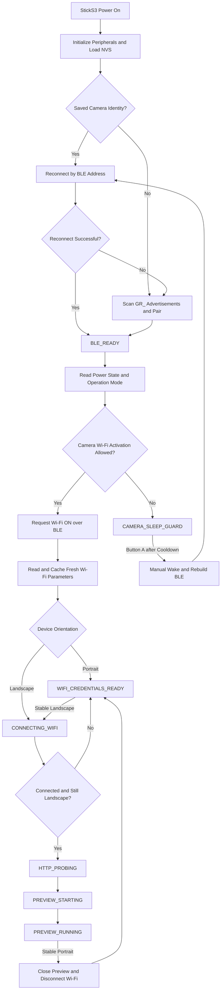

<p align="center">
  <a href="./README.md">
    
  </a>
  <a href="./README_EN.md">
    
  </a>
</p>

<p align="center">
  
</p>

<h1 align="center">RICOH GR Live View Shooting</h1>

<p align="center">
  An orientation-aware BLE remote shutter and wireless live-view firmware for RICOH GR cameras, running on the M5Stack StickS3.
</p>

<p align="center">
  The firmware uses <strong>BLE for camera discovery, pairing, wake control, and shutter control</strong>. It reads and caches camera Wi-Fi parameters dynamically, keeps the low-power remote interface in portrait, and joins camera Wi-Fi for HTTP MJPEG LiveView only in landscape.
</p>

> [!NOTE]
> For protocol and state-machine details, see the [architecture overview](docs/project_overview.md) and [RICOH BLE protocol notes](docs/ricoh_ble_protocol.md). See [UI and interaction design](docs/ui_interaction_design.md) for the UI architecture, orientation thresholds, and hardware verification checklist.

> [!NOTE]
> **Development note**: The firmware, architecture, and documentation in this repository were developed collaboratively by the author and the AI assistant Codex. Feedback and improvements are welcome through [Issues](https://github.com/sky18Dragon/RICOH-GR-Live-View-Shooting/issues) or Pull Requests.

---

## Core Capabilities

- **Orientation-gated connection lifecycle**: Portrait completes BLE connection, camera Wi-Fi activation, and credential caching without starting a Wi-Fi STA connection. Landscape continues to HTTP Probe and LiveView.
- **Dedicated portrait and landscape interfaces**: Portrait shows a 135×240 remote aperture; landscape shows a 240×135 full-screen preview. Low-pass filtering, hysteresis, stabilization, and minimum hold time prevent orientation chatter.
- **Smooth LiveView rendering**: The MJPEG parser feeds JPEGDEC, including ESP32-S3 optimizations, into LovyanGFX / M5Canvas. The JPEG viewport is synchronized whenever the Canvas dimensions change.
- **PSRAM-safe Canvas and frame buffer**: The 16-bit Canvas is explicitly allocated in PSRAM when available. A failed resize preserves the previous Canvas and retries every two seconds. MJPEG uses a separate 256 KB frame buffer to reduce fragmentation risk.
- **Camera standby protection**: `Power State` and `Operation Mode` are checked before connection work. A standby or powered-off camera enters `CAMERA_SLEEP_GUARD` to avoid repeated automatic wake attempts.
- **WLAN parameter caching**: SSID, BSSID, channel, passphrase, and security data are persisted in NVS for the landscape fast path. BLE remains the control anchor for connection and camera Wi-Fi activation.
- **BLE AF remote shutter**: Button A sends at most one AF+shoot command per complete press/release. Holding only adds visual and sound feedback.
- **Recoverable runtime monitoring**: Wi-Fi, HTTP stream, and valid JPEG frame health are checked periodically; a stalled LiveView triggers connection recovery.
- **Host-side Native tests**: 34 tests cover the orientation-gated state machine, MJPEG parsing, Supervisor, button input, orientation tracking, and UI animation.

---

## Quick Start

### 1. Build and Flash

Connect the M5Stack StickS3 over USB, install PlatformIO Core, and run:

```bash
# Build and upload the default StickS3 environment
platformio run -e m5stack-sticks3 --target upload

# Monitor serial output at 115200 baud
pio device monitor -b 115200
```

If port detection fails, append `--upload-port <port>`.

### 2. First-time Scan and Secure Pairing

1. Turn on the RICOH GR camera and enable Bluetooth in its settings.
2. Power on the StickS3. It scans automatically for BLE advertisements beginning with `GR_`.
3. Once found, the StickS3 performs secure bonding and saves the camera identity and BLE address in NVS.

### 3. Orientation-gated Wi-Fi and LiveView

1. After BLE connects, the firmware reads camera power and operation mode. When connection is allowed, it requests camera Wi-Fi ON over BLE and reads the latest parameters.
2. **Portrait startup**: Credentials are persisted, then the flow parks at `WIFI_CREDENTIALS_READY` without joining the camera AP.
3. **Landscape startup**: After caching the parameters, the firmware joins the camera AP, performs HTTP Probe, and enters `PREVIEW_RUNNING`.
4. **Portrait to landscape**: The flow resumes from the cached parameters without another BLE scan.
5. **Landscape to portrait**: LiveView closes, camera Wi-Fi disconnects, and the state returns to `WIFI_CREDENTIALS_READY`; BLE and the credential cache remain available.

If the device turns portrait during a blocking Wi-Fi connection attempt, the connection guard cancels that attempt and returns to credentials-ready. If the IMU is unavailable, the firmware treats the device as landscape so the original full connection flow remains available.

### 4. Verify Builds and Tests

```bash
# Build the host-side Native target
platformio run -e native

# Run all 34 Native tests
platformio test -e native

# Build the StickS3 firmware
platformio run -e m5stack-sticks3
```

Current baseline build usage: RAM 76,196 / 327,680 bytes (23.3%), Flash 1,301,497 / 3,342,336 bytes (38.9%).

---

## Controls and Interaction

| Physical Button | Context | Action |
| :--- | :--- | :--- |
| **Button A** | Camera ready | Sends at most one AF+shoot command on release. After a 300 ms hold, the aperture contracts, turns green, and plays feedback without sending an additional camera command. |
| **Button A** | `CAMERA_SLEEP_GUARD` | When allowed by the guard policy, performs an explicit wake, rebuilds the BLE stack, and reconnects without shooting. |
| **Button B** | Any state, hold for 3 seconds | Shows continuous progress and triggers the BLE pairing/cache reset once at the threshold. Releasing early cancels it. |
| **Power Button (BtnPWR)** | Any state, hold for about 1.2 seconds | Powers off the StickS3. |

Interaction rules:

- Portrait shows the centered remote aperture; landscape shows full-screen LiveView and a tiny battery indicator.
- A shot produces a 300 ms portrait flash or a 100 ms white shutter frame in landscape.
- Orientation is sampled every 40 ms, must remain stable for 500 ms, and is then held for at least 500 ms.
- Active brightness is 180 and sleep brightness is 24; dimming takes 900 ms and wake brightening takes 180 ms.
- Remote animation targets 25 FPS, sleep animation targets 8 FPS, and sound volume is 40.

The original interaction prototype is archived at [StickS3 Interaction Prototype](docs/ui-reference/StickS3_Interaction_Prototype.html).

---

## Core Architecture and State Machine

### Software Layers

- **[AppController](src/app/AppController.h)**: Central business state machine for the connection lifecycle, orientation gating, guards, and recovery events.
- **[SystemSupervisor](src/supervisor/SystemSupervisor.h)**: A health monitor called periodically by the main loop to detect a closed preview, stalled stream, or valid-frame timeout.
- **[BleCameraService](src/services/BleCameraService.h)**: BLE scanning, bonding, reconnect, camera state and Wi-Fi parameter reads, and shutter control.
- **[WifiPreviewService](src/services/WifiPreviewService.h)**: Wi-Fi STA, HTTP Probe, MJPEG stream, and LiveView lifecycle.
- **[UiCoordinator](src/ui/UiCoordinator.h)**: Maps application state, orientation, and input into UI scenes and user commands.
- **[OrientationTracker](src/ui/OrientationTracker.h)**: Applies the StickS3 hardware-axis mapping, low-pass filter, hysteresis, and stabilization timing.

### State Transition Flow



### Camera Power-off and Standby Guard

When the camera reports `BLE_STARTUP`, `POWER_OFF_TRANSFER`, or a powered-off state, the firmware clears the Wi-Fi/preview connection and enters `CAMERA_SLEEP_GUARD`. Automatic flow pauses during the 15-second cooldown. Button A then provides the explicit manual wake and BLE reconnect path, avoiding a background connection loop that repeatedly disturbs the camera.

---

## Key Configuration

Connection and guard settings live in [src/config.h](src/config.h); UI and orientation settings live in [src/ui/UiTheme.h](src/ui/UiTheme.h):

| Parameter | Default | Description |
| :--- | :---: | :--- |
| `BLE_SCAN_SECONDS` | `2` | Duration of one BLE scan cycle in seconds |
| `BLE_FAST_CONNECT_TIMEOUT_MS` | `3000` | Direct reconnect timeout for a saved BLE address |
| `BLE_CONNECT_TIMEOUT_MS` | `8000` | BLE connection timeout after discovery |
| `WIFI_CACHED_CONNECT_GRACE_MS` | `700` | Delay after requesting Wi-Fi ON before cached connection |
| `WIFI_CACHED_CONNECT_TIMEOUT_MS` | `1200` | Fast-path timeout using cached BSSID and channel |
| `WIFI_CONNECT_TIMEOUT_MS` | `15000` | Overall Wi-Fi STA connection timeout |
| `LIVEVIEW_STALL_TIMEOUT_MS` | `5000` | Valid preview-frame stall threshold |
| `CAMERA_POWER_OFF_COOLDOWN_MS` | `15000` | Camera power-off guard cooldown |
| `POWER_BUTTON_HOLD_MS` | `1200` | Power-button shutdown hold threshold |
| `KEY2_PAIRING_RESET_HOLD_MS` | `3000` | Button B pairing-reset hold threshold |
| `kOrientationSampleMs` | `40` | IMU orientation sampling interval |
| `kOrientationStableMs` | `500` | Candidate-orientation stabilization time |
| `kOrientationMinHoldMs` | `500` | Minimum hold time after an orientation change |
| `kOrientationHysteresisG` | `0.18f` | Portrait/landscape switch hysteresis |
| `kOrientationMinAxisG` | `0.35f` | Minimum dominant-axis gravity component |

The StickS3 hardware mapping treats dominant `abs(X)` as portrait and dominant `abs(Y)` as landscape.

---

## Camera Compatibility

> [!NOTE]
> The current firmware and protocol parameters have been verified on **RICOH GR IV** and **RICOH GR IV HDF**.

| Camera Series | Status | Notes |
| :--- | :---: | :--- |
| **RICOH GR IV HDF** | **Verified** | Core development and hardware test target; supports BLE shutter and LiveView |
| **RICOH GR IV** | **Verified** | BLE pairing/reconnect, Wi-Fi activation, LiveView, and BLE AF shutter verified |
| **RICOH GR III / GR IIIx** | **Not supported** | BLE handshake and wake timing differ by generation and are outside the current design target |
| **RICOH GR II** | **Not supported** | Lacks the BLE-first advertising and on-demand Wi-Fi AP control path required by this firmware |

---

## Project Structure

- [platformio.ini](platformio.ini) — StickS3 and Native environments, dependencies, and PSRAM configuration
- [src/main.cpp](src/main.cpp) — Hardware initialization, main loop, state actions, and connection guards
- [src/app/](src/app/) — Application states, flow actions, and `AppController`
- [src/services/](src/services/) — BLE, camera power policy, shutter, Wi-Fi, and preview services
- [src/supervisor/](src/supervisor/) — Runtime health monitoring and recovery events
- [src/ui/](src/ui/) — Orientation tracking, button commands, animation, sound, and UI scene coordination
- [src/display.cpp](src/display.cpp) — 16-bit rotating Canvas, PSRAM allocation, and display submission
- [src/camera_profile_store.cpp](src/camera_profile_store.cpp) — NVS persistence for BLE identity and Wi-Fi parameters
- [src/jpeg_decoder.cpp](src/jpeg_decoder.cpp) / [src/mjpeg_stream.cpp](src/mjpeg_stream.cpp) — JPEG decoding and MJPEG frame-boundary parsing
- [src/services/PreviewFrameBuffer.cpp](src/services/PreviewFrameBuffer.cpp) — 256 KB preview frame buffer and statistics
- [test/test_native/](test/test_native/) — 34 host-side Native tests

---

## Troubleshooting and Typical Logs

### Portrait Startup: Cache Credentials Without Wi-Fi Connection

```text
Flow: CONNECTING_BLE -> BLE_READY (BLE connected)
Flow: BLE_READY -> CHECKING_CAMERA_POWER
Flow: CHECKING_CAMERA_POWER -> ACTIVATING_WIFI
WiFi cache: saved (fresh BLE) ...
Flow: ACTIVATING_WIFI -> WIFI_CREDENTIALS_READY (portrait cached WiFi params; connection paused)
```

### Portrait to Landscape: Resume the Full Preview Flow

```text
Flow: WIFI_CREDENTIALS_READY -> CONNECTING_WIFI (landscape resumes cached WiFi params)
Flow: CONNECTING_WIFI -> HTTP_PROBING
Flow: HTTP_PROBING -> PREVIEW_STARTING
JPEG: viewport synced 240x135
Flow: PREVIEW_STARTING -> PREVIEW_RUNNING
```

### Landscape to Portrait: Close Preview and Disconnect Wi-Fi

```text
Flow: PREVIEW_RUNNING -> WIFI_CREDENTIALS_READY (portrait disconnects camera WiFi)
```

### Recovering from a Valid-frame Stall

```text
LiveView stall: frame_idle_ms=5200 stream_idle_ms=120 timeout_ms=5000
Supervisor: event=PreviewTimeout state=PREVIEW_RUNNING code=... detail=supervisor preview frame idle
Camera recovery: LiveView frame stall watchdog
```

---

## Accessories and Acknowledgements

- The project includes a 3D-printable hot-shoe mount for attaching the StickS3 to the camera.
- Special thanks to [wjhrdy](https://github.com/wjhrdy) for field verification of the [GR IV monochrome](https://github.com/sky18Dragon/RICOH-GR-Live-View-Shooting/issues/2) and for supporting the hot-shoe print.

---

## License

This project is licensed under the [GNU General Public License v3.0 (GPL-3.0)](LICENSE). You may modify, use, and redistribute the firmware, provided derivative works comply with GPL-3.0.
