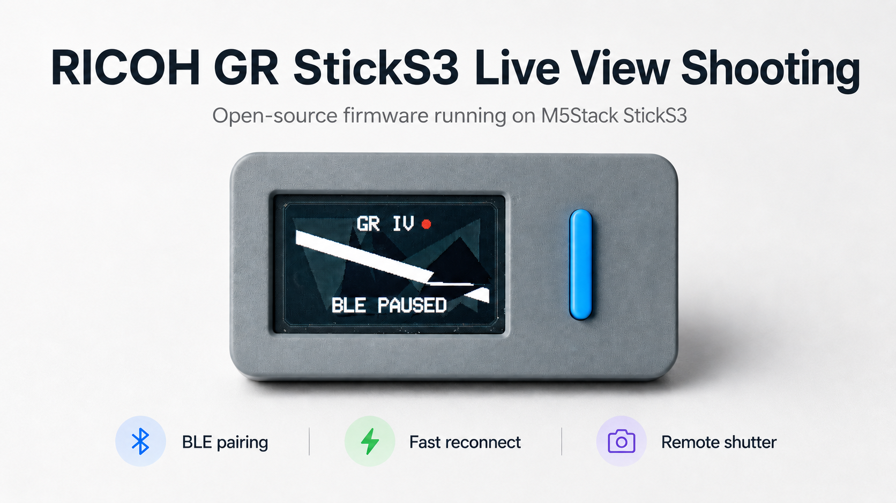
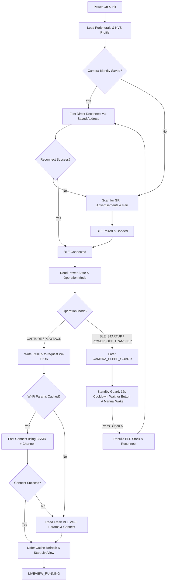

<p align="center">
  <a href="./README.md">
    
  </a>
  <a href="./README_EN.md">
    
  </a>
</p>

<p align="center">
  
</p>

<h1 align="center">RICOH GR Live View Shooting</h1>

<p align="center">
  A wireless live-view shooting and BLE remote shutter firmware running on the M5Stack StickS3 for RICOH GR cameras.
</p>

<p align="center">
  The firmware uses <strong>BLE as the entry point for camera discovery, pairing, wake control, and shutter control</strong>. It dynamically obtains Wi-Fi credentials over BLE and requests MJPEG live-view streams via HTTP API to render preview frames smoothly on the StickS3.
</p>

> [!NOTE]
> Looking for details on the communication protocol or state machine? Read [docs/project_overview.md](file:///C:/Users/Administrator/Documents/RICOH%20Viewfinder/docs/project_overview.md) for the architecture overview, and [docs/ricoh_ble_protocol.md](file:///C:/Users/Administrator/Documents/RICOH%20Viewfinder/docs/ricoh_ble_protocol.md) for detailed BLE characteristics and handles.

> [!NOTE]
> **Project Development Note**: The author of this repository does not have an embedded development background. All firmware code, system architecture design, and documentation in this repository were entirely developed and structured in collaboration with the AI assistant (Codex). Please excuse any code design issues or inefficiencies. You are highly welcome to open [Issues](https://github.com/sky18Dragon/RicohViewfinder/issues) or submit Pull Requests for discussion and improvement!

---

## What Ships (Core Capabilities)

* **High-framerate LiveView Rendering**: A dedicated MJPEG stream parser backed by ESP32-S3 hardware JPEG decoding directly onto LovyanGFX / M5Canvas, minimizing display latency.
* **Restructured Layered Architecture**: Transitioned from a single-file codebase to a clean Supervisor-Controller-Service pattern, significantly improving reliability and maintenance.
* **Camera Standby & Wake Guard**: Queries the camera's `Power State` and `Operation Mode` before enabling Wi-Fi to prevent waking up a camera that is explicitly powered down or in standby.
* **WLAN Parameter Caching**: Caches SSID, BSSID, channel, and encryption details in ESP32 NVS. Subsequent boots achieve ultra-fast connections in `<0.5s` by skipping BLE renegotiation.
* **Physical Button AF Shutter**: Fully implements the official RICOH BLE Shooting Service protocol, using Button A to trigger high-precision auto-focus (AF) and instant capture.
* **One-Click BLE Reset**: Long press Button B to clear stored BLE pairing and bonding data, allowing quick pairing with a new camera.
* **Host-side Native Test Suite**: Allows compiling and running data parser and state transition tests directly on your host machine without hardware.


---

## Quick Start

### 1. Build and Flash the Firmware
Connect the M5Stack StickS3 to your PC using a USB cable. Ensure PlatformIO Core is installed, then run:
```bash
# Build and upload the firmware
platformio run --target upload

# Optionally, specify the upload port if automatic detection fails
platformio run --target upload --upload-port COM6
```

### 2. First-time Scan and Pairing
1. Turn on your RICOH GR camera, and enable **Bluetooth** in the settings menu.
2. Power on the StickS3. The screen will display scanning status. It automatically looks for BLE advertisements starting with `GR_`.
3. Once found, the StickS3 initiates secure pairing (Bonding) and persists the bonded identity in NVS.

### 3. Automatic LiveView Startup
1. After pairing completes, the StickS3 requests Wi-Fi ON and reads the dynamically generated passphrase and BSSID over BLE.
2. The StickS3 joins the camera's Wi-Fi Access Point.
3. Once connected, it initiates a stream from `/v1/liveview` and starts displaying the camera view on the LCD screen.

---

## Controls

You can control the viewfinder's behavior using the buttons (Button A, Button B, and Power button) on the StickS3:

| Physical Button | App State / Context | Triggered Action |
| :--- | :--- | :--- |
| **Button A** | During LiveView (`LIVEVIEW_RUNNING`) | Triggers BLE Auto-Focus (AF) and shoots (writes `ShootingFlavor=IMMEDIATE`) |
| **Button A** | Standby Cooldown (`CAMERA_SLEEP_GUARD`) | Manually overrides the guard, resets the BLE stack, and attempts to wake/reconnect |
| **Button B** | Any State (Long Press for 3s) | Triggers BLE pairing reset: clears stored BLE pairing/bonding information, terminates active Wi-Fi/BLE connections, and restarts scanning for new camera pairing |
| **Power Button (BtnPWR)** | Any State (Long Press) | Gracefully terminates Wi-Fi/BLE connections, closes LiveView, and powers off the StickS3 |


---

## Core Architecture & Flow

### 1. Software Architecture Layout
The codebase has been refactored into distinct layers communicating via asynchronous events:
* **[SystemSupervisor](file:///C:/Users/Administrator/Documents/RICOH%20Viewfinder/src/supervisor/SystemSupervisor.h)**: A health monitor running as a background task. It detects stalled Wi-Fi / HTTP LiveView streams and schedules recovery actions.
* **[AppController](file:///C:/Users/Administrator/Documents/RICOH%20Viewfinder/src/app/AppController.h)**: The central business logic state machine, coordinating connections, power guards, manual wake overrides, and event dispatch.
* **[BleCameraService](file:///C:/Users/Administrator/Documents/RICOH%20Viewfinder/src/services/BleCameraService.h)**: Encapsulates BLE tasks, such as scanning, bonding, querying power/shutter services, and writing shutter commands.
* **[WifiPreviewService](file:///C:/Users/Administrator/Documents/RICOH%20Viewfinder/src/services/WifiPreviewService.h)**: Manages Wi-Fi STA connections and reads the HTTP MJPEG stream.

### 2. State Transition Flow
The diagram below details the application's connection and fallback paths from boot to live preview:



### 3. Camera Power-off and Sleep Protection (Standby Guard)
When the camera turns off (due to auto power-off or manual shutdown), or when the StickS3 boots and finds the camera in BLE standby (`BLE_STARTUP`):
1. The StickS3 immediately tears down its Wi-Fi and BLE connections to save camera power.
2. The state machine transitions to `CAMERA_SLEEP_GUARD` and starts a **15-second safety cooldown**.
3. During this cooldown and subsequent standby phase, **automatic wake requests are completely blocked**. The camera remains in standby until the user presses Button A to wake it intentionally.

---

## Key Configuration

Customize these constants in [src/config.h](file:///C:/Users/Administrator/Documents/RICOH%20Viewfinder/src/config.h) or `platformio.ini` to adjust timing:

| Parameter | Default Value | Description |
| :--- | :---: | :--- |
| `BLE_SCAN_SECONDS` | `2` | Duration of each Bluetooth scan cycle (seconds) |
| `BLE_FAST_CONNECT_TIMEOUT_MS` | `3000` | Timeout when reconnecting directly to a cached BLE address (ms) |
| `BLE_CONNECT_TIMEOUT_MS` | `8000` | Timeout when establishing a scanned BLE connection (ms) |
| `BLE_CONNECT_ATTEMPTS` | `12` | Maximum connection cycles when a cached identity exists |
| `RICOH_BLE_BONDED_SECURITY_WAIT_MS` | `1500` | Post-connect wait time for BLE security/encryption to settle (ms) |
| `RICOH_BLE_SECURITY_WAIT_MS` | `7000` | Max timeout for first-time security bonding to complete (ms) |
| `RICOH_BLE_POWER_NOTIFY_SETTLE_MS` | `30` | Short settle window after enabling power notifications, used to catch immediate power-off notifications before Wi-Fi ON |
| `WIFI_CACHED_CONNECT_GRACE_MS` | `700` | Warm-up delay after requesting Wi-Fi ON before trying cached credentials |
| `WIFI_CACHED_CONNECT_TIMEOUT_MS` | `1200` | Aggressive connection timeout for cached BSSID + Channel (ms) |
| `WIFI_CONNECT_TIMEOUT_MS` | `15000` | Overall connection timeout limit for Wi-Fi STA |
| `CAMERA_POWER_OFF_COOLDOWN_MS` | `15000` | Mandatory cooldown block duration after camera power-off is detected |

---

## Camera Compatibility

> [!WARNING]
> The current code and protocol parameters have been verified on **RICOH GR IV HDF** only.

| Camera Series | Status | Compatibility Notes |
| :--- | :---: | :--- |
| **RICOH GR IV HDF** | **Verified Working** | Core development target. Supports BLE shutter and LiveView out of the box. |
| **RICOH GR IV Series** | **Expected to Work** | Shares the same BLE/Wi-Fi/HTTP API generation. Untested but expected to be compatible. |
| **RICOH GR III / GR IIIx** | **Not Supported** | Uses different BLE handshakes and wake sequences. Outside the scope of this project. |
| **RICOH GR II** | **Not Supported** | Lacks the BLE-first broadcast wake-up and on-demand Wi-Fi AP control interfaces. |

---

## Project Structure

* [platformio.ini](file:///C:/Users/Administrator/Documents/RICOH%20Viewfinder/platformio.ini) — PlatformIO configuration and dependency mapping
* [src/main.cpp](file:///C:/Users/Administrator/Documents/RICOH%20Viewfinder/src/main.cpp) — Entry point, setup initialization, and main loop
* [src/app/](file:///C:/Users/Administrator/Documents/RICOH%20Viewfinder/src/app/) — Application state and control flow
  * [AppController.cpp](file:///C:/Users/Administrator/Documents/RICOH%20Viewfinder/src/app/AppController.cpp) / [AppController.h](file:///C:/Users/Administrator/Documents/RICOH%20Viewfinder/src/app/AppController.h) — State machine coordinator
  * [AppState.h](file:///C:/Users/Administrator/Documents/RICOH%20Viewfinder/src/app/AppState.h) — List of application states
  * [AppFlowActions.h](file:///C:/Users/Administrator/Documents/RICOH%20Viewfinder/src/app/AppFlowActions.h) — Action maps for flow transitions
* [src/supervisor/](file:///C:/Users/Administrator/Documents/RICOH%20Viewfinder/src/supervisor/) — Runtime health watchdog
  * [SystemSupervisor.cpp](file:///C:/Users/Administrator/Documents/RICOH%20Viewfinder/src/supervisor/SystemSupervisor.cpp) / [SystemSupervisor.h](file:///C:/Users/Administrator/Documents/RICOH%20Viewfinder/src/supervisor/SystemSupervisor.h) — Monitors stream health and triggers resets on stall
* [src/services/](file:///C:/Users/Administrator/Documents/RICOH%20Viewfinder/src/services/) — Protocol and stream transport layers
  * [BleCameraService.cpp](file:///C:/Users/Administrator/Documents/RICOH%20Viewfinder/src/services/BleCameraService.cpp) / [BleCameraService.h](file:///C:/Users/Administrator/Documents/RICOH%20Viewfinder/src/services/BleCameraService.h) — NimBLE client, queries modes/shutter characteristics
  * [WifiPreviewService.cpp](file:///C:/Users/Administrator/Documents/RICOH%20Viewfinder/src/services/WifiPreviewService.cpp) / [WifiPreviewService.h](file:///C:/Users/Administrator/Documents/RICOH%20Viewfinder/src/services/WifiPreviewService.h) — Wi-Fi link management and LiveView downloader
  * [PreviewFrameBuffer.cpp](file:///C:/Users/Administrator/Documents/RICOH%20Viewfinder/src/services/PreviewFrameBuffer.cpp) / [PreviewFrameBuffer.h](file:///C:/Users/Administrator/Documents/RICOH%20Viewfinder/src/services/PreviewFrameBuffer.h) — Circular double-buffered frame manager to reduce fragmentation and delay
* [src/camera_profile_store.cpp](file:///C:/Users/Administrator/Documents/RICOH%20Viewfinder/src/camera_profile_store.cpp) — Handles NVS profiles and Wi-Fi credential serialization
* [src/jpeg_decoder.cpp](file:///C:/Users/Administrator/Documents/RICOH%20Viewfinder/src/jpeg_decoder.cpp) / [mjpeg_stream.cpp](file:///C:/Users/Administrator/Documents/RICOH%20Viewfinder/src/mjpeg_stream.cpp) — Splits MJPEG streams and decodes JPEG frames using ESP32-S3 hardware acceleration
* [test/test_native/](file:///C:/Users/Administrator/Documents/RICOH%20Viewfinder/test/test_native/) — Local host-side unit tests verifying core logic and stream processing

---

## Troubleshooting & Logs

### 1. Normal Connect & Launch
```text
BLE: connected secure connect_ms=2800
Flow: BLE_SCAN -> BLE_READY (BLE connected)
BLE: power handle=0x00EB read value=0x01
BLE: operation mode read value=0x00 state=CAPTURE
BLE: power notify enabled cccd=0x00EC
BLE: Wi-Fi open requested
BLE: Wi-Fi parameters received ssid='GR_H264456' bssid='F2:3E:05:26:45:56' freq=2412 channel=1
WiFi cache: waiting 700ms for camera AP before cached connect
WiFi cache: trying cached params ssid='GR_H264456' bssid='F2:3E:05:26:45:56' channel=1 short_timeout=1200ms
WiFi: connect completed in 450ms channel=1 status=CONNECTED
Flow: WIFI_CONNECTING -> LIVEVIEW_RUNNING (LiveView opened)
LiveView: connected
```

### 2. Standby Intercept (Auto-wake Blocked)
```text
BLE: power handle=0x00EB read value=0x01
BLE: operation mode read value=0x02 state=BLE_STARTUP
WiFi blocked: camera operation mode=BLE_STARTUP while power=ON source=WiFi open
Flow: BLE_READY -> CAMERA_SLEEP_GUARD (BLE operation mode standby)
BLE guard: remote disconnect reason=533; auto wake paused for 15s, then manual wake required
```
*(The firmware shuts down connection elements, blocks automatic wake, and goes quiet)*

### 3. Watchdog Recovery on Stalled LiveView
```text
SystemSupervisor: checking preview health...
SystemSupervisor: liveview last frame time 5200 ms ago, threshold is 5000 ms
SystemSupervisor: liveview stall detected! Requesting system recovery.
Flow: LIVEVIEW_RUNNING -> BLE_READY (Resetting connections)
...
```

---

## License

This project is licensed under the [GNU General Public License v3.0 (GPL-3.0)](file:///C:/Users/Administrator/Documents/RICOH%20Viewfinder/LICENSE). You are free to modify, use, and distribute this firmware, provided any modifications or derivative works are also open-sourced under the GPL-3.0.
