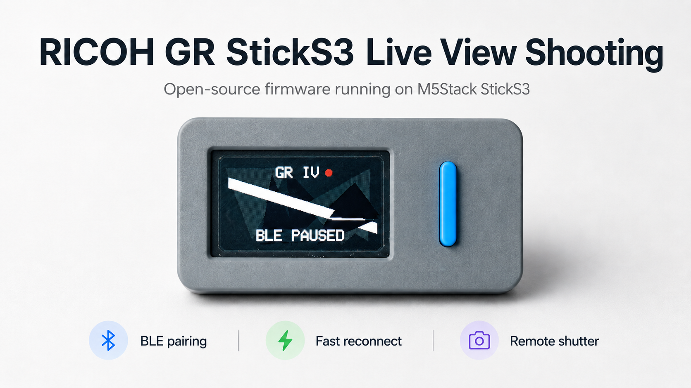
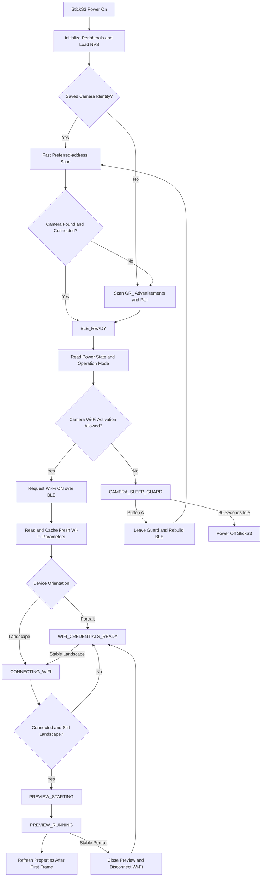

<p align="center">
  <a href="./README.md">
    
  </a>
  <a href="./README_EN.md">
    
  </a>
</p>

<p align="center">
  
</p>

<h1 align="center">RICOH GR Live View Shooting</h1>

<p align="center">
  An orientation-aware BLE remote shutter and wireless live-view firmware for RICOH GR cameras, running on the M5Stack StickS3.
</p>

<p align="center">
  The firmware uses <strong>BLE for camera discovery, pairing, wake control, and shutter control</strong>. It reads and caches camera Wi-Fi parameters dynamically, keeps the low-power remote interface in portrait, and joins camera Wi-Fi for HTTP MJPEG LiveView only in landscape.
</p>

> [!NOTE]
> For protocol and state-machine details, see the [architecture overview](docs/project_overview.md) and [RICOH BLE protocol notes](docs/ricoh_ble_protocol.md). See [UI and interaction design](docs/ui_interaction_design.md) for the UI architecture, orientation thresholds, and hardware verification checklist.

Bug reports and contributions are welcome through [Issues](https://github.com/sky18Dragon/RICOH-GR-Live-View-Shooting/issues) and Pull Requests.

---

## Core Capabilities

- **Orientation-gated connection lifecycle**: Portrait completes BLE connection, camera Wi-Fi activation, and credential caching without starting a Wi-Fi STA connection. Landscape starts LiveView first, then refreshes camera properties after the first frame.
- **Dedicated portrait and landscape interfaces**: Portrait shows a 135×240 remote aperture; landscape uses a 240×135 preview canvas. Low-pass filtering, hysteresis, stabilization, and minimum hold time prevent orientation chatter.
- **Faster LiveView rendering**: Espressif's SIMD JPEG decoder scales GR III-family frames directly to 216 x 144 RGB565. The display uses a centered 216 x 135 crop without a second resize.
- **Split memory strategy**: The landscape Canvas uses internal RAM when possible, while the JPEG output and 256 KB MJPEG frame buffer use PSRAM. Each allocation has a safe fallback.
- **Faster first-time BLE pairing**: A valid RICOH advertisement ends discovery early, scan-to-connect settling is reduced to 50 ms, and an initial SMP attempt that never starts is retried quickly while later attempts retain a full confirmation window.
- **Connection-driven scan animation**: Two bright-green dots repeatedly approach and separate throughout scanning and connection; they merge only after the BLE link is actually connected.
- **Camera standby protection and automatic shutdown**: A camera-initiated power-off, power-off notification, or BLE link loss enters `CAMERA_SLEEP_GUARD`, stopping automatic scan/reconnect. The StickS3 powers itself off after 30 seconds without input.
- **WLAN parameter caching**: SSID, BSSID, channel, passphrase, and security data are persisted in NVS for the landscape fast path. BLE remains the control anchor for connection and camera Wi-Fi activation.
- **Low-latency BLE AF shutter**: Button A sends one AF+shoot request immediately on the press edge. The Shooting Service and characteristics are warmed and cached at connection time, with low-latency connection parameters requested for subsequent shots.
- **Recoverable runtime monitoring**: Wi-Fi, HTTP stream, and valid JPEG frame health are checked periodically; a stalled LiveView triggers connection recovery.
- **Host-side Native tests**: 51 tests cover the orientation-gated state machine, CameraSleep, MJPEG parsing, Supervisor, button input, image fitting, orientation tracking, UI animation, and camera protocol detection.

---

## Quick Start

### 1. Download and Flash with M5Burner (Recommended)

No development environment is required. Open [M5Burner](https://docs.m5stack.com/en/download) and follow these steps:

1. Select **STICKS3** from the device list on the left.
2. Enter **GR** in the search box at the top.
3. Find **“理光 GR 实时取景拍摄”**.
4. Select the desired version and click **Download**.
5. Connect the StickS3 to your computer over USB, then click **Burn**.


> [!TIP]
> If the firmware has already been downloaded, the project card displays **Burn** directly. Use the version menu on the right to switch releases when needed.

### 2. Build and Flash from Source

Connect the M5Stack StickS3 over USB, install PlatformIO Core, and run:

```bash
# Build and upload the default StickS3 environment
platformio run -e m5stack-sticks3 --target upload

# Monitor serial output at 115200 baud
pio device monitor -b 115200
```

If port detection fails, append `--upload-port <port>`.

### 3. First-time Scan and Secure Pairing

1. Turn on the RICOH GR camera and enable Bluetooth in its settings.
2. Power on the StickS3. It scans automatically for BLE advertisements beginning with `GR_`.
3. Discovery ends as soon as a valid, connectable RICOH advertisement is found, and secure bonding begins.
4. On a GR III-family camera, copy the six-digit code from the camera to the StickS3. Button A changes the highlighted digit and a short press of Button B accepts it. GR IV-family cameras keep their existing confirmation flow.
5. The firmware saves the camera identity, BLE address, and bond in NVS after pairing.

If the first security exchange never starts, the firmware leaves the 3-second probe window and retries after 150 ms instead of waiting out a long dead attempt. The second and later attempts keep the full 7-second confirmation window.

### 4. Orientation-gated Wi-Fi and LiveView

1. After BLE connects, the firmware reads camera power and operation mode. When connection is allowed, it requests camera Wi-Fi ON over BLE and reads the latest parameters.
2. **Portrait startup**: Credentials are persisted, then the flow parks at `WIFI_CREDENTIALS_READY` without joining the camera AP.
3. **Landscape startup**: After caching the parameters, the firmware joins the camera AP and starts LiveView. Camera properties are refreshed after the first frame.
4. **Portrait to landscape**: The flow resumes from the cached parameters without another BLE scan.
5. **Landscape to portrait**: LiveView closes, camera Wi-Fi disconnects, and the state returns to `WIFI_CREDENTIALS_READY`; BLE and the credential cache remain available.

If the device turns portrait during a blocking Wi-Fi connection attempt, the connection guard cancels that attempt and returns to credentials-ready. If the IMU is unavailable, the firmware treats the device as landscape so the original full connection flow remains available.

### 5. Verify Builds and Tests

```bash
# Build the host-side Native target
platformio run -e native

# Run all 51 Native tests
platformio test -e native

# Build the StickS3 firmware
platformio run -e m5stack-sticks3
```

Current baseline build usage: RAM 82,892 / 327,680 bytes (25.3%), Flash 1,322,213 / 3,342,336 bytes (39.6%).

---

## Controls and Interaction

| Physical Button | Context | Action |
| :--- | :--- | :--- |
| **Button A** | GR III pairing code | Changes the highlighted digit. |
| **Button B** | GR III pairing code, short press | Accepts the highlighted digit and moves to the next one. |
| **Button B** | Outside pairing entry, short press | Toggles the LiveView mirror setting and saves it. |
| **Button A** | Camera ready | Immediately sends one AF+shoot command on press. Continuing to hold only contracts the aperture, turns it bright green, and plays feedback; it never repeats the command or starts continuous shooting. |
| **Button A** | `CAMERA_SLEEP_GUARD` | Leaves the guard, rebuilds the BLE stack, and returns to scanning without shooting. |
| **Button B** | Any state, hold for 3 seconds | Shows continuous progress and triggers the BLE pairing/cache reset once at the threshold. Releasing early cancels it. |
| **Power Button (BtnPWR)** | Any state, hold for about 1.2 seconds | Powers off the StickS3. |

Interaction rules:

- Portrait shows the centered remote aperture; landscape shows aspect-preserving LiveView and a tiny battery indicator.
- Scanning and BLE connection always show two bright-green dots moving together and apart; they merge only when `bleConnected=true`.
- A shot produces a 300 ms portrait flash or a 100 ms white shutter frame in landscape.
- Orientation is sampled every 40 ms, must remain stable for 500 ms, and is then held for at least 500 ms.
- Active brightness is 180 and sleep brightness is 24; dimming takes 900 ms and wake brightening takes 180 ms.
- Remote animation targets 25 FPS, sleep animation targets 8 FPS, and sound volume is 40.

The original interaction prototype is archived at [StickS3 Interaction Prototype](docs/ui-reference/StickS3_Interaction_Prototype.html).

---

## Core Architecture and State Machine

### Software Layers

- **[AppController](src/app/AppController.h)**: Central business state machine for the connection lifecycle, orientation gating, guards, and recovery events.
- **[SystemSupervisor](src/supervisor/SystemSupervisor.h)**: A health monitor called periodically by the main loop to detect a closed preview, stalled stream, or valid-frame timeout.
- **[BleCameraService](src/services/BleCameraService.h)**: BLE scanning, bonding, reconnect, camera state and Wi-Fi parameter reads, and shutter control.
- **[WifiPreviewService](src/services/WifiPreviewService.h)**: Wi-Fi STA, camera properties, MJPEG stream, and LiveView lifecycle.
- **[UiCoordinator](src/ui/UiCoordinator.h)**: Maps application state, orientation, and input into UI scenes and user commands.
- **[OrientationTracker](src/ui/OrientationTracker.h)**: Applies the StickS3 hardware-axis mapping, low-pass filter, hysteresis, and stabilization timing.

### State Transition Flow


```mermaid
flowchart TD
    A[StickS3 Power On] --> B[Initialize Peripherals and Load NVS]
    B --> C{Saved Camera Identity?}
    C -->|Yes| D[Fast Preferred-address Scan]
    C -->|No| E[Scan GR_ Advertisements and Pair]
    D --> F{Camera Found and Connected?}
    F -->|No| E
    F -->|Yes| G[BLE_READY]
    E --> G
    G --> H[Read Power State and Operation Mode]
    H --> I{Camera Wi-Fi Activation Allowed?}
    I -->|No| J[CAMERA_SLEEP_GUARD]
    I -->|Yes| K[Request Wi-Fi ON over BLE]
    K --> L[Read and Cache Fresh Wi-Fi Parameters]
    L --> M{Device Orientation}
    M -->|Portrait| N[WIFI_CREDENTIALS_READY]
    M -->|Landscape| O[CONNECTING_WIFI]
    N -->|Stable Landscape| O
    O --> P{Connected and Still Landscape?}
    P -->|No| N
    P -->|Yes| R[PREVIEW_STARTING]
    R --> S[PREVIEW_RUNNING]
    S --> Q[Refresh Properties After First Frame]
    S -->|Stable Portrait| T[Close Preview and Disconnect Wi-Fi]
    T --> N
    J -->|Button A| U[Leave Guard and Rebuild BLE]
    J -->|30 Seconds Idle| V[Power Off StickS3]
    U --> D
```

### Camera Power-off and Standby Guard

When the camera powers itself off, reports power value `0x00` over BLE, or an established BLE link ends with a non-zero disconnect reason, the firmware clears Wi-Fi/preview and enters `CAMERA_SLEEP_GUARD`. This scene never scans, reconnects, or turns camera Wi-Fi on by itself. Only Button A leaves the guard and returns to scanning. If there is no input for 30 seconds, the StickS3 powers itself off. The repeated guard-block log is emitted only once per guard entry to avoid serial-log flooding.

---

## Key Configuration

Connection and guard settings live in [src/config.h](src/config.h); UI and orientation settings live in [src/ui/UiTheme.h](src/ui/UiTheme.h):

| Parameter | Default | Description |
| :--- | :---: | :--- |
| `BLE_SCAN_SECONDS` | `2` | Duration of one BLE scan cycle in seconds |
| `BLE_CONNECT_TIMEOUT_MS` | `8000` | BLE connection timeout after discovery |
| `BLE_SCAN_TO_CONNECT_DELAY_MS` | `50` | Settling delay between scan completion and connection |
| `RICOH_BLE_FIRST_PAIRING_PROBE_MS` | `3000` | Fast probe window when initial SMP does not start |
| `BLE_FIRST_PAIRING_RETRY_DELAY_MS` | `150` | Fast retry delay after the first pairing probe |
| `WIFI_CACHED_CONNECT_GRACE_MS` | `700` | Delay after requesting Wi-Fi ON before cached connection |
| `WIFI_CACHED_CONNECT_TIMEOUT_MS` | `1200` | Fast-path timeout using cached BSSID and channel |
| `WIFI_CONNECT_TIMEOUT_MS` | `15000` | Overall Wi-Fi STA connection timeout |
| `LIVEVIEW_STALL_TIMEOUT_MS` | `5000` | Valid preview-frame stall threshold |
| `CAMERA_SLEEP_AUTO_POWER_OFF_MS` | `30000` | CameraSleep idle shutdown timeout |
| `POWER_BUTTON_HOLD_MS` | `1200` | Power-button shutdown hold threshold |
| `KEY2_PAIRING_RESET_HOLD_MS` | `3000` | Button B pairing-reset hold threshold |
| `kOrientationSampleMs` | `40` | IMU orientation sampling interval |
| `kOrientationStableMs` | `500` | Candidate-orientation stabilization time |
| `kOrientationMinHoldMs` | `500` | Minimum hold time after an orientation change |
| `kOrientationHysteresisG` | `0.18f` | Portrait/landscape switch hysteresis |
| `kOrientationMinAxisG` | `0.35f` | Minimum dominant-axis gravity component |

The StickS3 hardware mapping treats dominant `abs(X)` as portrait and dominant `abs(Y)` as landscape.

---

## Camera Compatibility

> [!NOTE]
> RICOH GR IV, GR IV HDF, and GR III HDF have completed hardware tests. Other GR III-family models still need their own regression runs.

| Camera Series | Status | Notes |
| :--- | :---: | :--- |
| **RICOH GR IV HDF** | **Verified** | Core development and hardware test target; supports BLE shutter and LiveView |
| **RICOH GR IV** | **Verified** | BLE pairing/reconnect, Wi-Fi activation, LiveView, and BLE AF shutter verified |
| **RICOH GR III HDF** | **Verified** | Clean passkey pairing, authenticated bond, Wi-Fi activation, `/v1/props`, and LiveView verified on hardware on August 1, 2026 |
| **RICOH GR III / GR IIIx** | **Experimental** | Uses the same UUID-based WLAN path as the verified GR III HDF, but these models still need a fresh regression run on this branch |
| **RICOH GR II** | **Not supported** | Lacks the BLE-first advertising and on-demand Wi-Fi AP control path required by this firmware |

---

## Project Structure

- [platformio.ini](platformio.ini) — StickS3 and Native environments, dependencies, and PSRAM configuration
- [src/main.cpp](src/main.cpp) — Hardware initialization, main loop, state actions, and connection guards
- [src/app/](src/app/) — Application states, flow actions, and `AppController`
- [src/services/](src/services/) — BLE, camera power policy, shutter, Wi-Fi, and preview services
- [src/supervisor/](src/supervisor/) — Runtime health monitoring and recovery events
- [src/ui/](src/ui/) — Orientation tracking, button commands, animation, sound, and UI scene coordination
- [src/display.cpp](src/display.cpp) — 16-bit rotating Canvas, PSRAM allocation, and display submission
- [src/camera_profile_store.cpp](src/camera_profile_store.cpp) — NVS persistence for BLE identity and Wi-Fi parameters
- [src/jpeg_decoder.cpp](src/jpeg_decoder.cpp) / [src/mjpeg_stream.cpp](src/mjpeg_stream.cpp) — JPEG decoding and MJPEG frame-boundary parsing
- [src/services/PreviewFrameBuffer.cpp](src/services/PreviewFrameBuffer.cpp) — 256 KB preview frame buffer and statistics
- [src/image_fit.h](src/image_fit.h) — Aspect-preserving contain rectangle for LiveView
- [src/camera_sleep_policy.h](src/camera_sleep_policy.h) — 30-second CameraSleep shutdown policy
- [test/test_native/](test/test_native/): 51 host-side Native tests
- [docs/gr3_porting_guide.md](docs/gr3_porting_guide.md): GR III protocol map, optional Android capture procedure, and hardware test checklist

---

## Troubleshooting and Typical Logs

### Portrait Startup: Cache Credentials Without Wi-Fi Connection

```text
Flow: CONNECTING_BLE -> BLE_READY (BLE connected)
Flow: BLE_READY -> CHECKING_CAMERA_POWER
Flow: CHECKING_CAMERA_POWER -> ACTIVATING_WIFI
WiFi cache: saved (fresh BLE) ...
Flow: ACTIVATING_WIFI -> WIFI_CREDENTIALS_READY (portrait cached WiFi params; connection paused)
```

### Portrait to Landscape: Resume the Full Preview Flow

```text
Flow: WIFI_CREDENTIALS_READY -> CONNECTING_WIFI (landscape resumes cached WiFi params)
Flow: CONNECTING_WIFI -> PREVIEW_STARTING
JPEG: viewport synced 240x135
Flow: PREVIEW_STARTING -> PREVIEW_RUNNING
LiveView: connected; props deferred until first frame + 1500ms
```

### Landscape to Portrait: Close Preview and Disconnect Wi-Fi

```text
Flow: PREVIEW_RUNNING -> WIFI_CREDENTIALS_READY (portrait disconnects camera WiFi)
```

### Recovering from a Valid-frame Stall

```text
LiveView stall: frame_idle_ms=5200 stream_idle_ms=120 timeout_ms=5000
Supervisor: event=PreviewTimeout state=PREVIEW_RUNNING code=... detail=supervisor preview frame idle
Camera recovery: LiveView frame stall watchdog
```

---

## Accessories and Acknowledgements

- The project includes a 3D-printable hot-shoe mount for attaching the StickS3 to the camera.
- Special thanks to [wjhrdy](https://github.com/wjhrdy) for field verification of the [GR IV monochrome](https://github.com/sky18Dragon/RICOH-GR-Live-View-Shooting/issues/2) and for supporting the hot-shoe print.

---

## License

This project is licensed under the [GNU General Public License v3.0 (GPL-3.0)](LICENSE). You may modify, use, and redistribute the firmware, provided derivative works comply with GPL-3.0.
