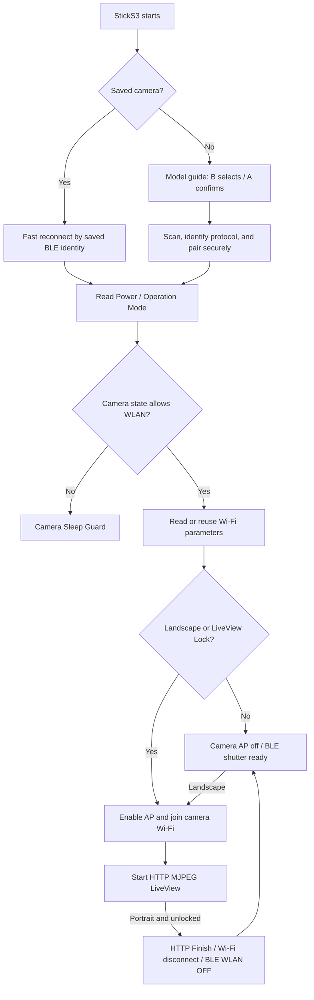

<p align="center">
  <a href="./README.md"></a>
  <a href="./README_EN.md"></a>
</p>

<p align="center">
  
</p>

<h1 align="center">RICOH GR Live View Shooting</h1>

<p align="center">
  A BLE remote shutter and wireless live-view firmware for RICOH GR cameras, running on the M5Stack StickS3.
</p>

The firmware uses BLE for model identification, pairing, reconnect, camera-state reads, WLAN control, autofocus, and capture. Camera Wi-Fi and HTTP MJPEG provide LiveView. In portrait it works as a low-power BLE shutter; in landscape it starts LiveView automatically. Returning to portrait closes LiveView and turns off the camera access point.

> [!IMPORTANT]
> Select the correct camera generation in the StickS3 pairing guide before first use. Select **GR III** for the GR III, GR IIIx, and their HDF variants. Select **GR IV** for the GR IV and GR IV HDF.

## Support Status

| Camera | Current Status | Transport |
| :--- | :---: | :--- |
| RICOH GR III | Implemented; full independent regression still required | GR III Family UUID protocol and dynamic six-digit passkey |
| RICOH GR IIIx | Hardware verified | Uses the same pairing and communication parameters as the GR III |
| RICOH GR III HDF / GR IIIx HDF | Experimental | Currently treated as GR III Family; no independent hardware evidence |
| RICOH GR IV | Hardware verified | GR IV Legacy fixed-handle protocol |
| RICOH GR IV HDF | Hardware verified | Uses the same generation protocol as the GR IV |
| RICOH GR II | Not supported | Capability placeholder only; no usable transport implementation |

See the [project architecture](docs/project_overview.md), [BLE protocol notes](docs/ricoh_ble_protocol.md), and [known issues](docs/known_issues.md) for evidence boundaries and safety rules.

## Features

- First-time model guide with isolated security parameters and communication paths for GR III Family and GR IV Family.
- Persistent camera BLE identity, bond, protocol profile, and Wi-Fi parameters, with direct-address reconnect on later boots.
- One Button A press sends one autofocus-and-capture operation; the GR III no longer needs a second press.
- Portrait keeps BLE shutter control available and turns the camera AP off; landscape re-enables the AP, joins Wi-Fi, and starts LiveView.
- Both GR III and GR IV keep BLE connected during LiveView for deterministic autofocus and shutter operation.
- Leaving LiveView first attempts HTTP WLAN Finish, disconnects the StickS3 Wi-Fi STA, then turns the camera AP off over BLE.
- Button B single-click mirror, double-click LiveView Lock, and three-second hold to clear pairing.
- IMU low-pass filtering, hysteresis, and stabilization timing to prevent orientation chatter.
- 256 KB PSRAM frame buffer, 8192-byte stream buffer, and ESP32-S3-optimized JPEG decoding.
- Wi-Fi, MJPEG stream, and valid-frame watchdogs with automatic LiveView recovery.
- Camera standby guard that prevents repeated scanning or WLAN writes from waking the camera unexpectedly.
- StickS3 battery/charging indication, camera status, connection animation, shutter feedback, and sound.

## Hardware and Software

- M5Stack StickS3 (ESP32-S3-PICO-1, 8 MB Flash, 8 MB PSRAM)
- A supported RICOH GR camera
- USB-C data cable
- A prebuilt merged BIN and M5Burner, or PlatformIO Core

The default build uses Arduino, `espressif32@6.12.0`, M5Unified, M5PM1, NimBLE-Arduino 2.5.0, ArduinoJson 7.x, and Espressif `esp_new_jpeg`.

## Install the Firmware

### M5Burner

1. Select custom firmware in M5Burner and import the project's single-file merged BIN.
2. Select ESP32-S3 and set the flash offset to `0x0000`.
3. If M5Burner exposes Flash Mode, select `DIO`. Erasing Flash before the first installation is recommended.
4. Restart the StickS3 after flashing completes.

> [!WARNING]
> M5Burner requires a full image containing the Bootloader, partition table, `boot_app0`, and application. Do not flash `.pio/build/m5stack-sticks3/firmware.bin` as a complete image at `0x0000`, and do not force the merged Bootloader header to QIO. Either mistake can leave the device on a black screen.

### Build from Source

```bash
# Build and upload to StickS3
pio run -e m5stack-sticks3 -t upload

# Monitor serial output
pio device monitor -b 115200
```

If automatic port detection fails, append `--upload-port <port>`.

## First-time Pairing

1. Turn on the camera and open its Bluetooth pairing screen.
2. With no saved camera, the StickS3 opens the model-selection guide.
3. Press **Button B** to switch between `GR III` and `GR IV`; press **Button A** to confirm.
4. The firmware scans for and accepts only a camera matching the selected generation. A generation mismatch cannot perform WLAN, power, or shutter writes.
5. After pairing, camera identity, protocol profile, bond, and usable Wi-Fi parameters are stored in NVS.

The pairing guide owns both buttons, so model selection cannot accidentally trigger the shutter, display mirror, LiveView Lock, or pairing reset.

### GR III / GR IIIx Six-digit Code

GR III Family uses the dynamic six-digit passkey shown on the camera:

- Short A press: increment the current digit (cycles 0–9).
- Short B press: confirm the current digit and move to the next position.
- Long A press: submit the current six digits immediately.
- Hold B for three seconds: cancel entry and enter the pairing-reset flow.
- Entry window: 45 seconds.

### GR IV / GR IV HDF

GR IV Family retains its Legacy security configuration and fixed passkey `123456`. GR III KeyboardDisplay settings, signing-key distribution, and UUID WLAN path are never applied to GR IV.

## Controls

| Button | Context | Action |
| :--- | :--- | :--- |
| Button A | Pairing guide | Confirm the selected camera generation |
| Button B | Pairing guide | Switch between GR III and GR IV |
| Button A | Camera ready | Trigger one AF + shutter command on press; holding does not repeat it |
| Button A | Camera sleep guard | Request one safe manual reconnect without taking a picture |
| Button B single-click | Normal UI | Toggle and persist LiveView image mirroring |
| Button B double-click | LiveView | Toggle LiveView Lock; a locked preview stays active in portrait |
| Hold Button B for three seconds | Paired state | Clear camera profile, Wi-Fi cache, and BLE bonds, then return to the pairing guide |
| Hold the power button for about 1.2 seconds | Any state | Power off the StickS3 |

Holding Button A for more than 300 ms shows focus animation and sound feedback, but the camera command is still sent only once.

## Orientation and Camera AP Lifecycle

### Portrait: BLE Shutter

- BLE remains connected for autofocus, shutter, and camera-state handling.
- With a valid Wi-Fi cache, the firmware does not enable the AP merely to read the same values again.
- First pairing may briefly enable the AP to retrieve parameters, then immediately turns it off over BLE.
- Returning from LiveView closes the HTTP stream, disconnects StickS3 Wi-Fi, and sends the generation-specific WLAN OFF command for both GR III and GR IV.

### Landscape: LiveView

- The camera AP is re-enabled over BLE.
- Cached SSID, BSSID, and channel are tried first; a failed fast path falls back to fresh BLE parameters.
- The firmware opens the `/v1/liveview` MJPEG stream and defers `/v1/props` until after the first frame.
- BLE stays connected on both GR III and GR IV, so Button A continues to use the BLE AF shutter.

Orientation must remain stable for about 500 ms before switching. If the IMU is unavailable, the firmware falls back to landscape preview mode. With LiveView Lock enabled by a Button B double-click, portrait orientation no longer closes the preview.

## GR III and GR IV Protocol Differences

| Item | GR III / GR IIIx | GR IV / GR IV HDF |
| :--- | :--- | :--- |
| Pairing | Camera-generated six-digit code, KeyboardDisplay | Legacy fixed `123456`, DisplayYesNo |
| WLAN control | Service and Characteristic UUIDs | Verified fixed handles |
| Wi-Fi parameters | SSID, passphrase, optional channel; BSSID learned after connection | SSID, passphrase, security, frequency, and BSSID |
| Shutter preparation | Direct Operation Request `{START, AF}` | Legacy Shooting Flavor write, then Operation Request |
| BLE during LiveView | Kept connected | Kept connected |
| Leave LiveView | HTTP Finish + BLE UUID WLAN OFF | HTTP Finish + BLE handle WLAN OFF |

GR III and GR IIIx are one `GR3_FAMILY` in the current implementation and do not have separate pairing or transport parameters. GATT characteristics are discovered by UUID; reference handles recorded from a GR IIIx are not treated as a cross-model contract.

## Runtime Flow


```mermaid
flowchart TD
    A[StickS3 starts] --> B{Saved camera?}
    B -->|No| C[Model guide: B selects / A confirms]
    B -->|Yes| D[Fast reconnect by saved BLE identity]
    C --> E[Scan, identify protocol, and pair securely]
    D --> F[Read Power / Operation Mode]
    E --> F
    F --> G{Camera state allows WLAN?}
    G -->|No| H[Camera Sleep Guard]
    G -->|Yes| I[Read or reuse Wi-Fi parameters]
    I --> J{Landscape or LiveView Lock?}
    J -->|No| K[Camera AP off / BLE shutter ready]
    J -->|Yes| L[Enable AP and join camera Wi-Fi]
    L --> M[Start HTTP MJPEG LiveView]
    M -->|Portrait and unlocked| N[HTTP Finish / Wi-Fi disconnect / BLE WLAN OFF]
    N --> K
    K -->|Landscape| L
```

## Build and Test

```bash
# Run host-side Native tests
pio test -e native

# Build the StickS3 release firmware
pio run -e m5stack-sticks3
```

Current commit baseline:

- Native: 85 / 85 passed.
- StickS3: release build succeeded.
- RAM: 65,468 / 327,680 bytes (20.0%).
- Flash: 1,401,749 / 3,342,336 bytes (41.9%).

Automated coverage includes protocol detection, security profiles, pairing recovery, NVS migration, orientation transitions, button isolation, AP lifecycle, BLE shutter behavior, MJPEG parsing, UI, and runtime watchdogs. Automated tests do not replace hardware regression across camera bodies and firmware versions.

## Troubleshooting

### Black Screen after Flashing

- Confirm that a full merged image was flashed at `0x0000`.
- Confirm that the Bootloader Flash Mode stayed DIO and was not forced to QIO by the merge tool.
- Erase Flash and install a hardware-verified release package again.

### Camera Not Found or Pairing Fails

- Confirm that the camera is on its Bluetooth pairing screen and the correct generation was selected in the guide.
- If the StickS3 was removed on the camera, also hold B for three seconds on the StickS3 to clear the stale local bond.
- GR III Family must use the six-digit code currently shown by the camera, not the GR IV fixed code.

### Landscape Does Not Start LiveView

- Confirm that the device is not in the camera sleep guard or pairing guide.
- Hold landscape for at least 500 ms; optionally double-click B to enable LiveView Lock.
- At 115200 baud, check the log for BLE WLAN ON, Wi-Fi connection, and `/v1/liveview` status.

### Camera AP Remains after Returning to Portrait

The normal log shows HTTP WLAN Finish, local Wi-Fi disconnect, then BLE WLAN deactivation. The camera may need a short time to stop advertising its AP. If it persists, record the camera model, firmware version, and complete orientation-transition log.

## Project Layout

- [src/main.cpp](src/main.cpp): hardware initialization, main loop, and business-action adapters.
- [src/app/](src/app/): connection, orientation, AP, and LiveView state machine.
- [src/ricoh/](src/ricoh/) and [src/ricoh_ble_client.cpp](src/ricoh_ble_client.cpp): GR III/GR IV protocol routing and BLE implementation.
- [src/services/](src/services/): BLE, Wi-Fi, LiveView, and shutter services.
- [src/ui/](src/ui/): pairing guide, buttons, orientation, animation, sound, and scene coordination.
- [src/camera_profile_store.cpp](src/camera_profile_store.cpp): camera profile, display settings, and Wi-Fi cache persistence.
- [src/jpeg_decoder.cpp](src/jpeg_decoder.cpp) and [src/mjpeg_stream.cpp](src/mjpeg_stream.cpp): JPEG decoding and MJPEG frame parsing.
- [test/test_native/](test/test_native/): host-side Native automated tests.
- [docs/](docs/): protocol, state-machine, hardware-verification, and test material.
- [cad/](cad/): printable StickS3 hot-shoe adapters and editable models.

## Accessories and Contributions

Printable StickS3 hot-shoe adapters are included; see [cad/README.md](cad/README.md). Please use [Issues](https://github.com/sky18Dragon/RICOH-GR-Live-View-Shooting/issues) to share the camera model, camera firmware, StickS3 commit, and redacted logs, or submit a Pull Request.

This project was developed collaboratively by the author and the Codex AI assistant. Thanks to everyone who contributed protocol analysis, hardware verification, or mechanical design.

## License

This project is licensed under the [GNU General Public License v3.0](LICENSE). Modified and redistributed versions must comply with GPL-3.0.
