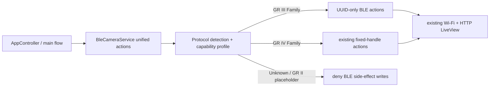

# Project Overview

## 目标

本项目是在 M5Stack StickS3（ESP32-S3）上运行的 RICOH GR 无线取景与遥控快门固件。在线链路由相机 Profile 决定：GR III/IV 通过 BLE 发现、安全连接和启动 WLAN，再复用相机 HTTP `/v1/props`、`/v1/liveview` 与 MJPEG 渲染；未来 GR II 可通过 ManualOnly/ManualConfiguration Profile 接入，而不把 BLE 写死为所有相机的前提。

## 运行时架构

| 模块 | 职责 |
| --- | --- |
| `src/camera_protocol_profile.*` | 代际、能力、WLAN 动作/凭据方法、运行时检测与安全决策 |
| `src/ble_pairing_policy.*` | 地址类型归一化、Passkey 纯逻辑、明确安全错误计数与 Bond 自愈策略 |
| `src/ricoh_ble_client.*` | GR III UUID 与 GR IV fixed-handle 的统一 BLE 实现；内部副作用门控 |
| `src/services/BleCameraService.*` | 对 Controller 暴露统一 Result API、Profile 和安全状态 |
| `src/camera_profile_schema.*` | 可 Native 测试的 NVS metadata v3→v4 升级/往返规则 |
| `src/camera_profile_store.*` | NVS 保存 BLE 身份、代际、能力版本、凭据来源与有效性、Wi-Fi 缓存 |
| `src/main.cpp` / `src/app/*` | 状态机、Power/Operation Mode 门控、Sleep Guard、恢复与按键调度 |
| `src/gr_wifi.*` / `src/services/WifiPreviewService.*` | STA 连接，成功后回采实际 BSSID/Channel，HTTP LiveView |
| `src/mjpeg_stream.*` / `src/jpeg_decoder.*` | MJPEG 切帧、JPEG 解码与显示 |

## 协议 Profile

| Profile | BLE | WLAN 激活 | 凭据 | 快门 | HTTP LiveView |
| --- | --- | --- | --- | --- | --- |
| `Gr4Family` | Pairing/Bond | `BleFixedHandle` | `BleFixedHandles` | BLE | 是 |
| `Gr3Family` | Passkey/Bond | `BleNetworkTypeUuid` | `BleUuidCharacteristics` | BLE | 是 |
| `Gr2Family` | 未实现 | `ManualOnly` | `ManualConfiguration` | 未实现 | 能力占位，未验证 |
| `Unknown` | 只读识别 | 禁止 | 禁止 | 禁止 | 不进入 |

NVS Profile schema 为 v4。旧 v3 数据继续读取，保留原 BLE 身份、Bond 和有效 Wi-Fi 缓存；由于旧数据没有代际字段，加载后 Profile 为 Unknown，首次安全重连时重新识别，不强迫有效的 GR IV 用户重新配对。

## 安全状态机要点

- GR III WLAN 必须同时满足 encrypted、authenticated、Profile=GR3 和 fresh Operation Mode=CAPTURE。
- Unknown 不执行 WLAN/Power/Shutter 写入；GR III 不访问 GR IV WLAN fixed handles。
- GR III 待机连接会断开；自动新连接只读探测间隔不短于 8 秒。Button A 只缩短等待，不绕过 Capture 门控。
- GR IV 继续使用原有 fixed-handle、Power/Operation Mode、缓存快速连接和关机保护路径。
- Long-press Button B 清除 NVS 身份/Profile/Wi-Fi 缓存和本地 BLE Bonds 后重新扫描。

## 机型支持状态

| 机型 | 状态 | 证据边界 |
| --- | --- | --- |
| RICOH GR IV / GR IV HDF | 已实机验证 | 原项目记录；本次共享安全设置变更仍需回归矩阵 |
| RICOH GR III / GR IIIx | 实现完成，等待实机验证 | 当前分支 Native/编译通过；无本分支目标相机测试 |
| RICOH GR III HDF / GR IIIx HDF | 实验性支持 | 无独立实机证据 |
| RICOH GR II | 暂不支持 | 仅扩展 Profile，不含通信实现 |

## 已验证的构建事实

- PlatformIO 默认固件环境：`m5stack-sticks3`；Native 环境：`native`。
- 目标框架：Arduino / `espressif32@6.12.0`；NimBLE-Arduino `2.5.0`。
- 当前代码在 2026-07-18 运行 `platformio test -e native` 为 27/27，通过 `platformio run -e m5stack-sticks3`。
- 上述结果只证明纯逻辑与编译，不证明 GR III/IV 实机链路。

## TODO_UNVERIFIED

- 当前分支的 GR III/GR IIIx 全链路和 GR IV/IV HDF 回归矩阵。
- HDF 版本的 GR III Family GATT 一致性。
- 长时间 LiveView FPS、内存碎片和多固件版本兼容性。

涉及相机唤醒的改动必须同时阅读 `docs/power_state_policy.md` 和 `docs/ricoh_ble_protocol.md`。
