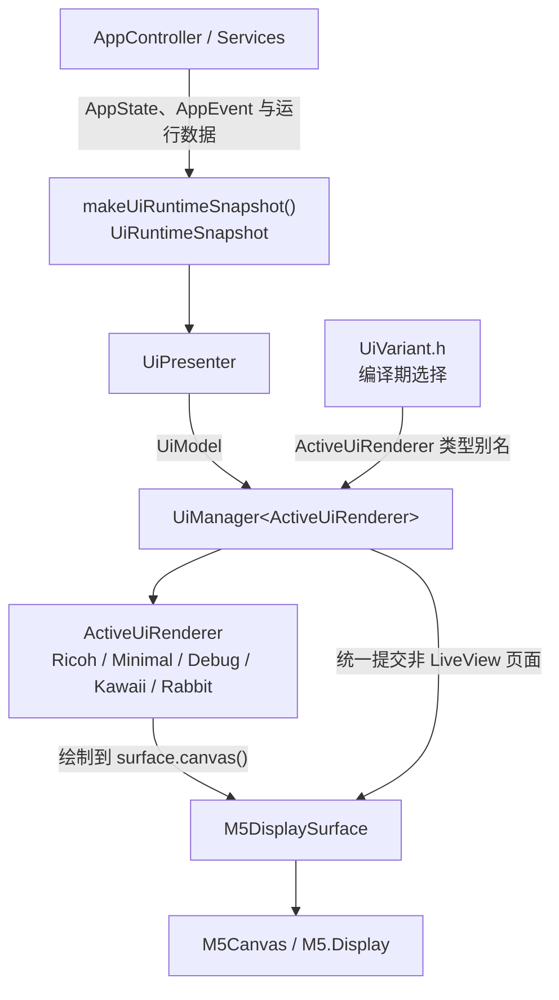

# UI Variant Architecture

## 目标与边界

UI 子系统把相机连接、预览和快门业务与具体画面分开。业务层只发布强类型状态和语义事件；UI 可以在编译期更换外观或裁剪元素，但不得改变 BLE、Wi-Fi、HTTP、LiveView、快门、恢复或电源保护行为。

本文描述当前代码结构。编译成功和 Native 测试通过只能证明构建与主机侧逻辑符合预期，不等同于 StickS3 屏幕、帧率或相机链路已经完成实机验证；实机回归项目见 [test_plan.md](./test_plan.md)。

## 分层与数据流



各层职责如下：

| 层 | 职责 | 不负责 |
| --- | --- | --- |
| `AppController` / Services | 状态机、BLE、Wi-Fi、HTTP、相机控制、恢复与业务事件 | 颜色、坐标、页面布局、选择 UI Variant |
| `makeUiRuntimeSnapshot()` | 从现有运行态收集一次只读快照 | 推断画面布局或直接绘图 |
| `UiPresenter` | 用 `AppState` 和结构化字段映射 `UiScreen`、`UiPhase` 与 `UiModel` | 解析展示文案、访问硬件或网络 |
| `UiManager<ActiveUiRenderer>` | 页面分派、指纹/Dirty 检测、非 LiveView 刷新节流、调用 Renderer 和 Surface | 相机业务和 JPEG 解码 |
| `ActiveUiRenderer` | 只根据 `UiModel` 在传入的 Canvas 上绘图 | 创建/提交 Canvas、网络请求、状态机操作 |
| `M5DisplaySurface` | `M5.begin()`、rotation、Canvas 生命周期、`present()`、宽高 | 业务状态映射和页面视觉设计 |

`detail`、`errorMessage` 等字符串只用于展示。`UiPresenter` 和 Renderer 不得通过查找 `WIFI`、`CONNECTING`、`CAMERA STANDBY` 等文本来推断业务状态；页面和阶段必须来自枚举或布尔字段。

## UiModel 字段

`UiRuntimeSnapshot` 是业务运行态与 UI 的输入边界，`UiPresenter::present()` 将其转换为以下 `UiModel`：

| 字段 | 类型 | 含义 |
| --- | --- | --- |
| `screen` | `UiScreen` | `Boot`、`Status`、`LiveView`、`Settings`、`Error` 或 `Shutdown` |
| `phase` | `UiPhase` | BLE、相机电源、Wi-Fi、HTTP、预览、快门、恢复等强类型展示阶段 |
| `appState` | `AppState` | 生成 Model 时的业务状态，供诊断显示使用 |
| `bleConnected` | `bool` | BLE 当前是否连接 |
| `wifiConnected` | `bool` | Wi-Fi 当前是否连接 |
| `previewRunning` | `bool` | LiveView 流当前是否运行 |
| `cameraStandby` | `bool` | 相机是否处于待机/关机保护态 |
| `shutterReady` | `bool` | BLE 快门条件是否满足 |
| `shutterStatus` | `UiShutterStatus` | `Idle`、`Shooting`、`Succeeded`、`Failed`；用于短时快门反馈，不依赖文案 |
| `wifiRssi` | `int32_t` | Wi-Fi RSSI；未连接时为 `0` |
| `fps` | `float` | 当前统计窗口的渲染 FPS |
| `renderedFrames` | `uint32_t` | 已送入 JPEG 渲染路径的帧统计 |
| `droppedFrames` | `uint32_t` | MJPEG 解析器记录的丢帧数 |
| `cameraName` | `const char*` | 相机名称 |
| `cameraModel` | `const char*` | 相机型号 |
| `battery` | `const char*` | 相机电量展示文本 |
| `localIp` | `const char*` | StickS3 的 Wi-Fi 本地地址展示文本 |
| `detail` | `const char*` | 仅供展示的事件/状态细节 |
| `errorCode` | `int` | 错误代码 |
| `errorMessage` | `const char*` | 错误展示文本 |

文本指针借用现有运行态字符串，只保证在当前 `present()` / `render()` 调用期间有效。Renderer 不应保存这些指针，也不应在每帧复制为大型动态对象。

`UiRuntimeSnapshot` 还包含 `shutterStatus`、`recovering`、`pairingReset`、`shutdownRequested`、`errorActive` 等结构化输入。Presenter 用它们选择 `UiPhase` 或 `UiScreen`，因此 Renderer 无需解析事件文案。快门成功/失败状态由运行态保存一个短截止时间，使下一批 LiveView 帧能显示强类型反馈，而不是解析 `detail`。

## 页面刷新规则

非 LiveView 页面由 `UiManager::update()` 统一处理：

- `Boot`、`Status`、`Settings`、`Error`、`Shutdown` Renderer 可以清屏。
- Model 指纹或页面变化会标记 Dirty。
- 非强制刷新受 `statusMinRedrawMs` 节流，当前默认值为 1500 ms。
- Renderer 完成绘制后，由 `UiManager` 调用一次 `M5DisplaySurface::present()`。
- `UiScreen::LiveView` 传入普通 `update()` 时不会清屏，也不会上屏；LiveView 必须走帧回调专用链路。

`UiScreen::Settings` 当前只是 Renderer 契约中的静态页面：`UiManager` 能在收到该 Screen 时调用 `renderSettings()` 并上屏，但 `UiPresenter::mapScreen()` 尚不会产生 `Settings`，按钮层也没有把 `OpenSettings` 接入运行流程。页面中的快门、滤镜、曝光、Wi-Fi、配对和休眠值均为视觉样稿，不会读取或修改相机设置。

## LiveView Canvas 所有权

每个成功解码帧严格按以下顺序处理：

```text
JpegDecoder::drawFrame(&displaySurface.canvas(), data, len)
  -> UiPresenter::present(makeUiRuntimeSnapshot())
  -> UiManager::renderLiveViewOverlay(model)
  -> M5DisplaySurface::present()       // 本帧唯一一次上屏
```

约束：

- JPEG Decoder 只把本帧像素写入 `M5DisplaySurface` 拥有的 Canvas。
- `renderLiveViewOverlay()` 只能叠加元素，不得 `fillScreen()`、`clear()` 或绘制不透明全屏背景。
- Renderer 不得调用 `present()`、`pushSprite()`，也不得创建新的全屏 Sprite。
- 只有 JPEG 解码成功才绘制 Overlay 并上屏；解码失败的帧不执行这两步。
- 同一成功帧只调用一次 `M5DisplaySurface::present()`，避免闪烁和重复传输。

更完整的数据读取与恢复流程见 [wifi_preview_flow.md](./wifi_preview_flow.md)。

## 当前 UI Variants

`src/ui/core/UiVariant.h` 根据 `UI_VARIANT` 生成 `ActiveUiRenderer` 类型别名，不使用运行时动态分配。

| Variant | 宏值 | PlatformIO 环境 | 用途 |
| --- | ---: | --- | --- |
| Ricoh | `UI_VARIANT_RICOH=1` | `sticks3-ui-ricoh` | 默认的 Ricoh 视觉界面 |
| Minimal | `UI_VARIANT_MINIMAL=2` | `sticks3-ui-minimal` | 简洁状态页和轻量 Overlay |
| Debug | `UI_VARIANT_DEBUG=3` | `sticks3-ui-debug` | 显示阶段、连接和帧统计等诊断信息 |
| Kawaii | `UI_VARIANT_KAWAII=4` | `sticks3-ui-kawaii` | 紫色插画背景、角色和装饰性 HUD |
| Rabbit | `UI_VARIANT_RABBIT=5` | `sticks3-ui-rabbit` | 右侧像素兔子背景、左侧安全文本区和轻量 LiveView HUD |

兼容环境 `m5stack-sticks3` 继承 Ricoh Variant。最小编译矩阵：

```bash
pio run -e sticks3-ui-ricoh
pio run -e sticks3-ui-minimal
pio run -e sticks3-ui-debug
pio run -e sticks3-ui-kawaii
pio run -e sticks3-ui-rabbit
pio run -e m5stack-sticks3
```

Kawaii 的文件结构、六个页面和已知限制见 [ui_kawaii_theme.md](./ui_kawaii_theme.md)。

## UI 元素编译期开关

共有六个通用宏和两个 Kawaii 专用宏。它们只决定某个元素是否参与绘制，不得停止对应业务数据的采集或维护：

| 宏 | 元素 | Ricoh 默认 | Minimal 默认 | Debug 默认 | Kawaii 默认 |
| --- | --- | :---: | :---: | :---: | :---: |
| `UI_FEATURE_FPS` | FPS | 开 | 关 | 开 | 开 |
| `UI_FEATURE_FRAME_STATS` | 帧数/丢帧统计 | 开 | 关 | 开 | 关 |
| `UI_FEATURE_WIFI_RSSI` | Wi-Fi RSSI/信号图标 | 开 | 开 | 开 | 开 |
| `UI_FEATURE_BATTERY` | 电量 | 开 | 开 | 开 | 开 |
| `UI_FEATURE_CAMERA_MODEL` | 相机型号 | 开 | 关 | 开 | 开 |
| `UI_FEATURE_FOCUS_BRACKET` | 对焦框 | 开 | 开 | 开 | 开 |
| `UI_FEATURE_MASCOTS` | Kawaii 角色 | 未使用 | 未使用 | 未使用 | 开 |
| `UI_FEATURE_PATTERN_BACKGROUND` | Kawaii 图案背景 | 未使用 | 未使用 | 未使用 | 开 |

每个宏都支持三态值：

- `-1`：使用当前 Variant Profile 的默认值，也是未定义宏时的行为。
- `0`：编译期关闭。
- `1`：编译期开启。

例如，在某个环境的 `build_flags` 中保留 Kawaii Variant、关闭角色和图案背景：

```ini
build_flags =
    ${env:m5stack-sticks3-base.build_flags}
    -DUI_VARIANT=4
    -DUI_FEATURE_MASCOTS=0
    -DUI_FEATURE_PATTERN_BACKGROUND=0
```

Renderer 使用 `if constexpr` 读取 Profile，关闭的绘制分支在编译期裁剪。开关不得影响相机属性刷新、RSSI 读取、帧统计、LiveView 启动或快门能力。

## Renderer 六方法契约

所有 Active Renderer 必须提供相同的六个公开方法：

```cpp
void renderBoot(LovyanGFX& canvas, const UiModel& model);
void renderStatus(LovyanGFX& canvas, const UiModel& model);
void renderSettings(LovyanGFX& canvas, const UiModel& model);
void renderLiveViewOverlay(LovyanGFX& canvas, const UiModel& model);
void renderError(LovyanGFX& canvas, const UiModel& model);
void renderShutdown(LovyanGFX& canvas, const UiModel& model);
```

`renderSettings()` 与其他非 LiveView 页面一样由 `UiManager` 统一 `present()`；它当前只验证页面契约和视觉布局。`renderLiveViewOverlay()` 则只能在 JPEG 底图上叠加，既不能清屏，也不能自行 `present()`。

## 新增 UI Variant

新增 Variant 时：

1. 在 `src/ui/variants/<name>/` 实现 Renderer；Theme、Layout 和 Profile 放在同一 Variant 目录。
2. 实现统一的六个方法：`renderBoot()`、`renderStatus()`、`renderSettings()`、`renderLiveViewOverlay()`、`renderError()`、`renderShutdown()`。
3. 在 `UiVariant.h` 增加唯一宏值和 `ActiveUiRenderer` 类型别名分支；不要在业务文件散布 `#if UI_VARIANT`。
4. 在 `platformio.ini` 增加继承 `m5stack-sticks3-base` 的环境，并设置对应 `-DUI_VARIANT=<value>`。
5. 为 Profile 默认值和 Presenter/Model 契约增加 Native 测试，并把新环境加入编译矩阵。
6. 在 StickS3 上检查所有页面和 LiveView Overlay；编译通过不能替代实机检查。

Renderer 接口依赖应限于 `UiModel`、Variant 自身的 Theme/Layout/Profile 和 LovyanGFX 绘图 API。Renderer 严禁包含或调用：

- BLE、Wi-Fi 或 HTTP 模块；
- `AppController` 的业务操作、NVS 或相机控制；
- `M5.begin()`；
- `pushSprite()` 或 `M5DisplaySurface::present()`；
- `delay()` 或其他阻塞式等待。

## 回归验证

Native 三套测试由 `pio test -e native` 统一运行：基础逻辑、Presenter 映射和 Variant Profile 契约。固件还必须编译 Ricoh、Minimal、Debug、Kawaii、Rabbit 和旧兼容环境。主题编译或 Native 契约测试不能替代 StickS3 实机视觉、性能与相机链路验证；完整命令和待验证项目见 [test_plan.md](./test_plan.md)。
