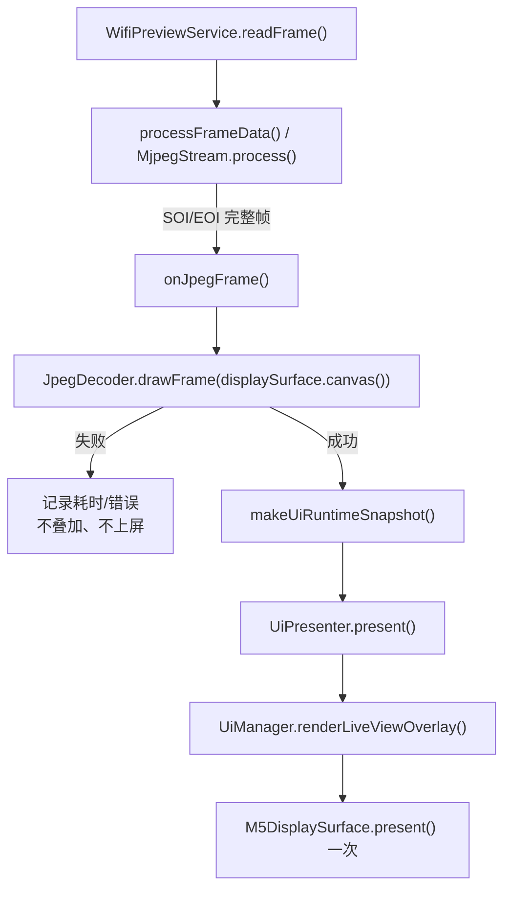

# Wi-Fi and Preview Flow

## 端到端流程

从 `src/main.cpp`、`AppController`、Wi-Fi/Preview Services、MJPEG/JPEG 模块和 UI 子系统确认，当前主路径为：

```text
setup()
  -> M5DisplaySurface.begin()
  -> UiPresenter / UiManager 使用 Boot Model 绘制启动页
  -> power / buttons / decoder / Wi-Fi STA / profile init
  -> 分配 256 KiB PreviewFrameBuffer
  -> mjpeg.begin(frameBuffer, onJpegFrame)
  -> AppController.runCameraFlowOnce()

runCameraFlowOnce()
  -> BLE scan 或保存地址直连
  -> 检查相机 Power State / Operation Mode
  -> BLE_READY
  -> 通过 BLE 激活相机 Wi-Fi
  -> 缓存 Wi-Fi 参数短超时连接，失败则读取最新 BLE 参数回退
  -> HTTP /v1/props
  -> HTTP /v1/liveview
  -> LIVEVIEW_RUNNING

loop()
  -> AppController.planTick()
  -> buttons / camera flow / Wi-Fi monitor / props refresh / LiveView monitor
  -> SystemSupervisor health check
  -> Wi-Fi profile refresh
  -> 非 LiveView 状态 UI 按需刷新
  -> delay(1)
```

相机待机/关机保护和 BLE 断线恢复仍属于业务层。Ricoh、Minimal、Debug、Kawaii、Rabbit 的编译期选择不会改变上述连接顺序。

## HTTP API

- Props：`GET /v1/props HTTP/1.1`，使用 `Connection: close`。
- LiveView：`GET /v1/liveview HTTP/1.1`，使用 `Connection: keep-alive`。
- 默认 HTTP endpoint：`192.168.0.1:80`。
- `readHttpHeaders()` 最多读取 2048 bytes header。
- Props body 上限为 16 KiB。

## Wi-Fi 连接策略

当前实现保持以下策略：

- ESP32 使用 Station 模式，并为 BLE + Wi-Fi 共存启用 modem sleep 和自动重连。
- 连接参数支持 SSID/password、BSSID 和 channel hint。
- `ConnectGuard` 在连接轮询期间检查 BLE 是否仍连接；BLE 丢失时可提前停止 Wi-Fi 连接。
- 缓存参数连接使用短超时；失败后回退到通过 BLE 读取的新参数。
- 使用 channel hint 的连接和全局连接分别受配置超时限制。
- 缓存连接成功后延迟刷新 BLE Wi-Fi 参数，避免阻塞刚建立的 LiveView。

UI 重构不得改变这些超时、回退和保护时序。

## MJPEG、JPEG 与上屏

MJPEG 字节流到屏幕的完整路径：



具体事实：

- `MjpegStream` 通过 SOI `0xFFD8` 和 EOI `0xFFD9` 组帧。
- Preview frame buffer 容量为 256 KiB；stream read buffer 为 2048 bytes。
- `JpegDecoder` 使用 JPEGDEC `openRAM()`，像素格式为 `RGB565_BIG_ENDIAN`。
- JPEG scale 由 `JPEG_SCALE_POLICY` 控制，当前默认 `JPEG_SCALE_HALF`。
- Decoder 直接写入 `M5DisplaySurface` 持有的 Canvas，不自行上屏。
- 只有成功解码帧才叠加当前 Variant 的 Overlay，并由 Surface `present()` 一次。
- 解码失败帧会记录渲染耗时和错误，不执行 Overlay 或 `present()`。

## Canvas 所有权与 Overlay 约束

| 组件 | 可以做 | 不可以做 |
| --- | --- | --- |
| `JpegDecoder` | 把 JPEG 像素写入传入的 Canvas | 选择 UI、绘制 Overlay、上屏 |
| `ActiveUiRenderer` | 在成功解码后的 Canvas 上叠加必要元素 | 清空 LiveView、创建全屏 Sprite、网络操作、上屏 |
| `UiManager` | 调用 Renderer；非 LiveView 页面统一 `present()` | 在普通状态刷新中清空/提交 LiveView |
| `M5DisplaySurface` | 拥有 Canvas，执行唯一的硬件提交 | 推断业务状态或选择页面样式 |

`renderLiveViewOverlay()` 必须满足：

- 不调用 `fillScreen()` 或 `clear()`；
- 不绘制覆盖整帧的不透明背景；
- 不调用 `M5.begin()`、`pushSprite()`、`present()` 或 `delay()`；
- 不访问 BLE、Wi-Fi、HTTP、NVS 或相机控制；
- 不改变 MJPEG 读取大小、JPEG scale 或流处理节奏。

Boot、Status、Settings、Error 和 Shutdown 页面可以由 Renderer 清屏。`UiManager::update()` 收到 `UiScreen::LiveView` 时直接返回，不会在两帧之间额外清屏或上屏。Settings 当前没有 Presenter 映射或按键导航，只是非 LiveView 静态 Renderer 契约，不参与 Preview 数据流。

## UI 数据刷新

`makeUiRuntimeSnapshot()` 从 AppController、Services 和现有统计值收集 BLE、Wi-Fi、Preview、相机待机、快门、RSSI、FPS、帧计数和相机属性。`UiPresenter` 再根据强类型字段生成 `UiModel`。

六个通用 `UI_FEATURE_*` 开关只裁剪对应的 UI 绘制元素（包括 Overlay 或 Debug 状态页中的同类元素）。Kawaii 额外使用 `UI_FEATURE_MASCOTS` 和 `UI_FEATURE_PATTERN_BACKGROUND`；前者可移除页面角色与 LiveView 边缘小角色，后者只影响非 LiveView 页面中由代码绘制的背景图案。即使某个 Variant 不显示这些元素，业务层仍应继续维护 FPS、RSSI、电量和帧统计；开关不得成为跳过属性刷新或网络检查的条件。

Kawaii 的 LiveView Overlay 由边缘状态 Badge、Wi-Fi/电量、可选相机型号、对焦框、小角色和底部操作条组成。它与其他 Variant 遵守同一约束：只在已解码 JPEG Canvas 上绘制，不调用 `fillScreen()` / `clear()`，不调用 `present()`，最终仍由帧回调统一 `M5DisplaySurface::present()` 一次。

## 实时预览性能风险

后续优化 LiveView 时重点检查：

1. Wi-Fi 阻塞读取、连接超时和 HTTP header/body 超时。
2. `JpegDecoder::lastDecodeMs()` 与完整 render 时间。
3. 每帧唯一一次 `present()` 的耗时；不得在 Renderer 中增加第二次提交。
4. 256 KiB 帧缓冲是否发生 overflow/dropped frame。
5. 是否引入每帧 malloc/free、动态大字符串或新建 Canvas。
6. BLE/Wi-Fi 共存时的任务争用与 modem sleep 行为。
7. LiveView 路径是否新增 `delay()` 或其他阻塞等待。
8. 解码、网络和日志是否造成 watchdog 风险。
9. 高频串口日志是否影响预览吞吐。
10. Overlay 绘制复杂度是否导致不同 Variant 的 FPS 明显分化。

## 待实机确认

- Ricoh、Minimal、Debug、Kawaii、Rabbit Overlay 在真实画面上是否可读且不闪烁、不残留、不清空底图。
- 四个 Variant 的实际 FPS、平均 JPEG decode/render 耗时和 dropped frames。
- Kawaii 代码绘制角色、背景与边缘 HUD 在 StickS3 上的颜色、裁切和性能；当前仍无实机结论。
- 长时间运行时 heap/PSRAM、MJPEG stall 和恢复表现。
- 相机 LiveView 分辨率、帧率、单帧最大大小的采样值。
- Wi-Fi RSSI 与卡顿的相关阈值。

未附带串口日志、屏幕录像或测试记录时，以上项目应保持“待验证”，不能由编译结果推断。完整回归步骤见 [test_plan.md](./test_plan.md)。
